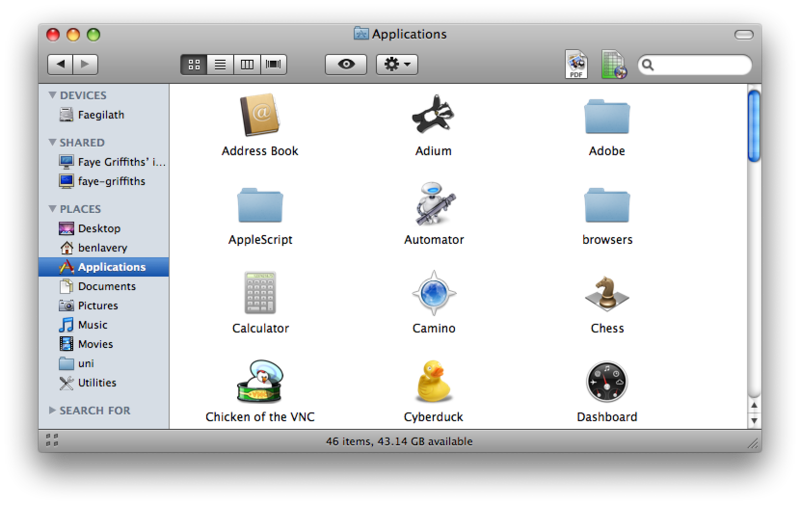
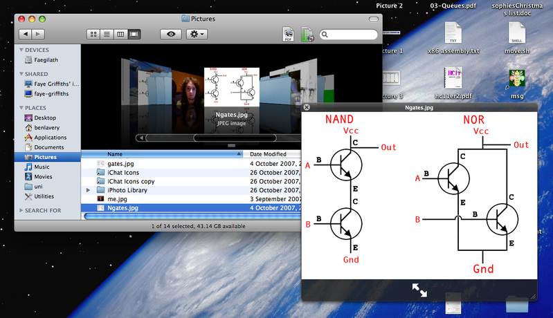
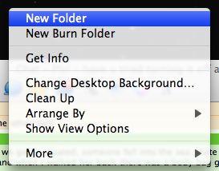
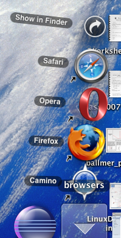

The 26th October: about 11am, I received a small box from a man who travelled in an Orange lorry.
With great eagerness I signed the form and ripped open the packaging to find a shiny box containing a DVD on it. On the DVD was Apple's latest edition of OS X: Leopard, Mac OS 10.5.

Thirty minutes it took me to install Leopard, while it was installing I perused the net looking for all the applications I used to have. With a restart I was launched into the Leopard Welcome sequence, swirling through space (like the background in Time Machine). After this I was taken to the set-up screens where I chose my language, set up user accounts etc...

Leopard launched me into my desktop environment where I sat for a while in awe. I quickly installed all of my previous applications and copied over some library folders, I was really surprised that when copying the Adium folder I just re-launched Adium and it recognised all my previous settings, down to how big the contacts window was!

With my applications installed I made my way familiarising myself with the new Finder and System Preferences interface...

**Finder**

Finder has had a nice remake, with various useful bits down the left hand side, I think I prefer the old Finder window, but the bits across the top are useful.

Coverflow is good, can't see it being hugely useful, but it shows how the technology has been developed and can be used around the system.

All the menus have also had a make-over, it now has roundy corners!

**Dock**
The Dock has, of course, had it's re-modelling, the new 3D shelf has been long awaited by some Mac users, and has already been condemned by others.
Looking at a hack which allows the user to bring back a 2D Dock, I really think I prefer the 3D shelf...

**Stacks**

Stacks are brilliant! I develop Java and C applications for university and I use two versions of the Eclipse IDE, I now have these in a folder somewhere on my system, the folder was plonked onto the Dock and it turned into a Stack, I now have easy access to my IDEs and it only takes up one space on my Dock!
I also create the odd website here and there, having a Stack with all of my browsers in is great! They splay out and I have easy access to the apps with only one space in the Dock taken up!

So, things that don't work...There has been news of BSODs on Leopard, if you read this, the lesson to learn is to NOT do an upgrade! Do a archive and install, or a fresh install.
Other than that, all my Apps work, I have had trouble installing Fink, and such things that Fink installs for you, such as Lynx browser...

Other than that, I have had a very enjoyable experience to date with Leopard, I look forward to Apple releasing the incremental updates to add new features.
