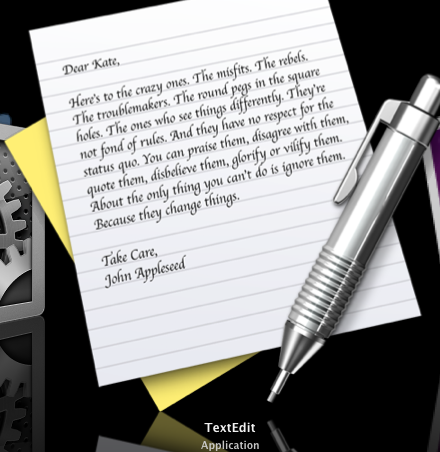

A fellow Mac User has pointed me to look at TextEdit.app with Coverflow. Blown up it looks like this:
<!--more-->

> Here's to the crazy ones. The misfits. The rebels. The troublemakers. The round pegs in the square holes.
> 
> The ones who see things differently. They're not fond of rules. And they have no respect for the status quo.
> 
> You can praise them, disagree with them, quote them, disbelieve them, glorify or vilify them. About the only thing you can't do is ignore them. Because they change things.

The poem seems to be created by Apple for use as an advert: [Clicky for YouTube][3] - Thanks to CC on the MacUser forums.

As for John Appleseed, there is a Wiki on him [here][4], I've linked you down to the place where he concerns Apple Inc.

I wonder who Kate might be...

  [3]: http://www.youtube.com/watch?v=Dvn_Ied9t4M
  [4]: http://en.wikipedia.org/wiki/Johnny_Appleseed#In_modern_culture
