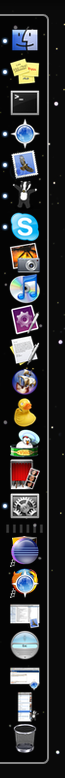
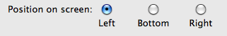
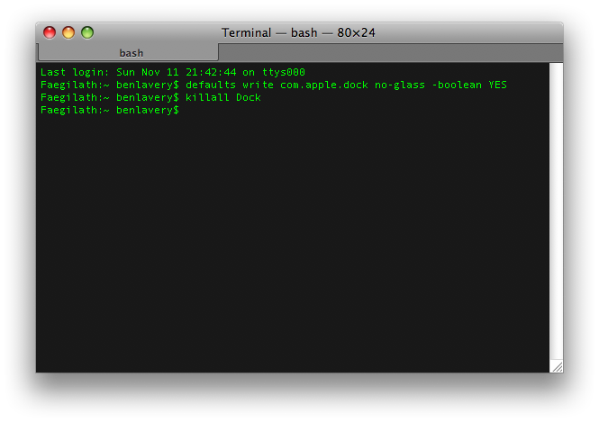
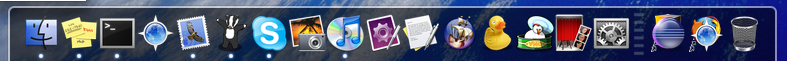

Have you upgraded to Leopard and decided you really don't like the new 3D 'shelf'?

Never fear! Apple have given us two options...
<!--more-->

**First option**  
Our first option is to open System Preferences, open the Dock preferences then place our Dock on the left or right of the screen:

**Second option**  
We have another option for you if you want your 2D Dock at the bottom of the screen.
We have three steps, first step is to open your Terminal, next type in:
defaults write com.apple.dock no-glass -boolean YES
Next type:
killall Dock
This should look like this in your Terminal screen:

Once you have done this you Dock should look like this:

If you want to revert back to the 3D Dock simply type the following into the Terminal:
defaults write com.apple.dock no-glass -boolean NO
killall Dock

There you go, your 2D Dock in Leopard.
