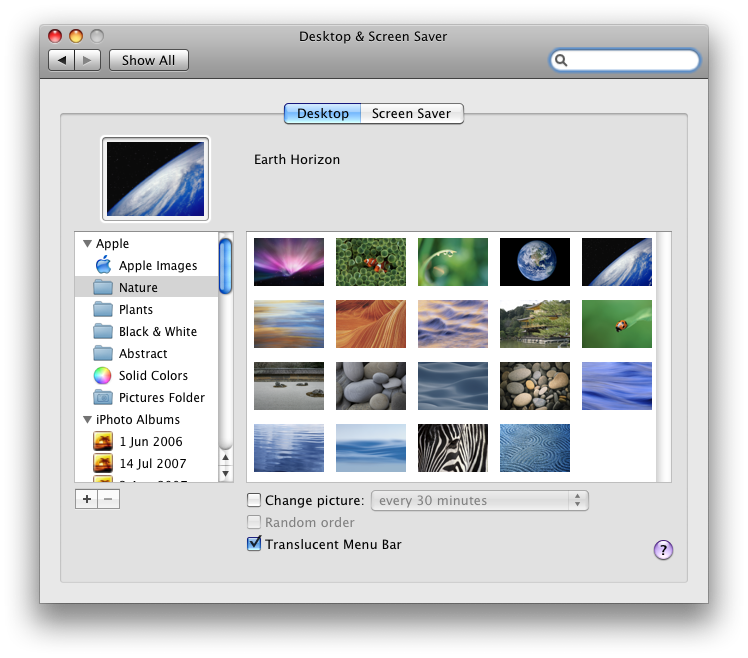

Today, 11th February, Apple release the second system update to Leopard. So what did we get?

As normal, there are a number of things to make the system generally more stable, these include updates to 'Back to my Mac', 'Active Directory', Networking and some other bit. One thing that I'm looking forward to is the improvements on 802.1X and general AirPort stability.

Some things that are updated, which are quite cool include:

**Dock &gt; Stacks:**
New [list view][1], and the [ability to have just a Folder icon][2] in place of the stack.

**Time Machine:**
Time Machine now lets you have n icon on the Menu Bar which allows you to do things like ["Back Up Now"][3].

**Menu Bar:**
The Menu Bar now comes in 'solid' mode! Many users criticised the Leopard menu bar for being slightly transparent, now you can turn off transparency in the Desktop preferences!

There is also a Sync icon in the Menu Bar allowing you to quickly use iSync!

  [1]: /2008/02/11/10.5.2-is-out/stacklistview.png
  [2]: /2008/02/11/10.5.2-is-out/newstackoptions.png
  [3]: /2008/02/11/10.5.2-is-out/syncandtimemachine.png
