Just over a week ago I found that my MacBook wasn't charging, but the charger was plugged in and on. I inspected the cable and found that it had melted just outside of the transformer!
<!--more-->
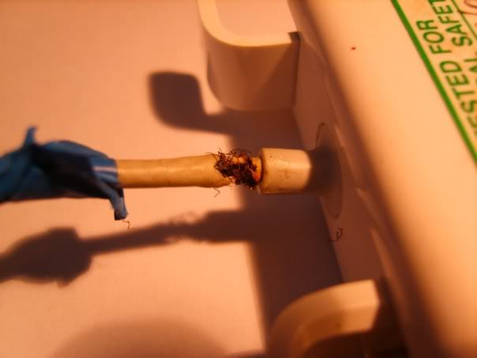

I temporarily fixed it with some blue insulation tape, but today, it failed all together :(

I have already ordered one off of eBay, ordered on Tuesday and dispatched the following day. Should hopefully be here anytime soon.

In the mean time, I have fixed the transformer :D A fair bodge job, but it seems to work now.
Prior to the work, I spent about an hour trawling the internet for a how-to, couldn't find one, so here's my own.

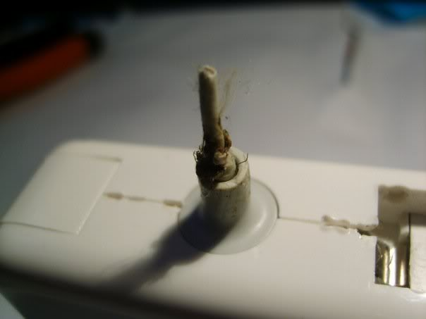
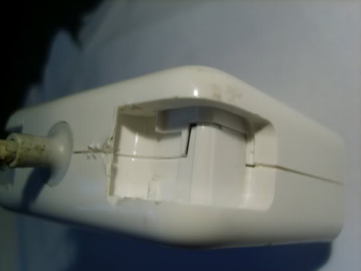
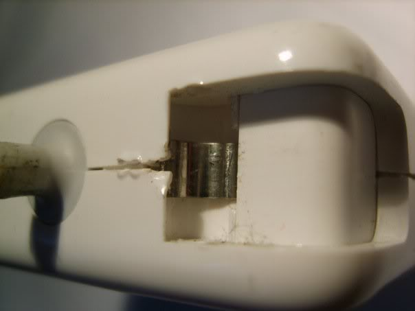

My burnt area was right up close to the transformer, so I needed to get in to sort out this problem. First, I cut the wire close to the transformer, so the magsafe adaptor is connected to the wire and burnt/damaged wire. 

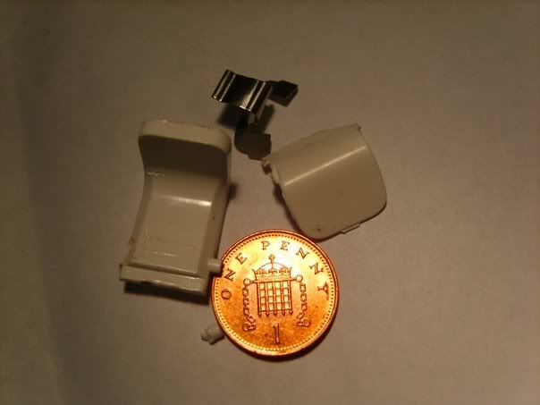

I then set about forcing off the little clips the pop out enabling you to wrap up the cable. I couldn't find a way of preserving these, so they were snapped off. Also, snap out the little metal clip which makes them springy.

After this, I needed to break into the casing. This is hard as it seems to be one, moulded unit. So I forced the rubbery flex protector where the little stub of cable clung and managed to fish out the rubber material. I then had several holes into the case. To get the case open 'simply' take a screw driver and a hammer (that can't be good?), then chisel away at the plastic in the gap. After about two hours, you should have chipped through the casing. Well done! You will hear cracking as you chip away. Don't be worried!

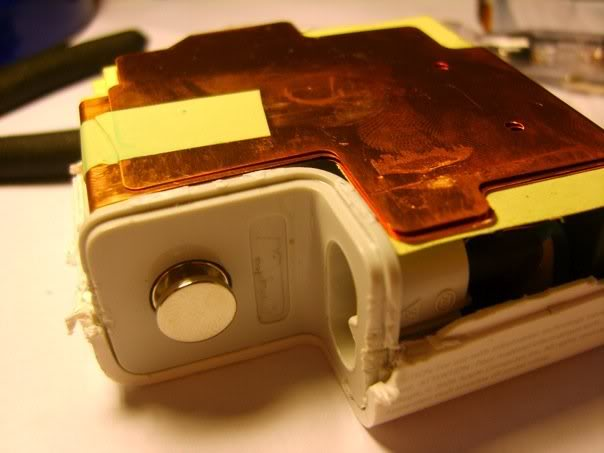

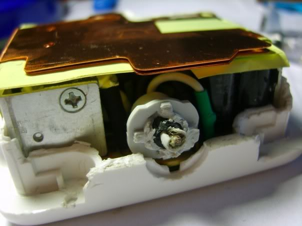

With the case off, you will see the little transformer, wrapped in copper, guessing this is to dissipate the heat. You can carefully unwrap the copper plates, and slide out the inner board. With the top exposed, you can nip away at the white and black wires just at the base of the last of the rubbery flex protector.

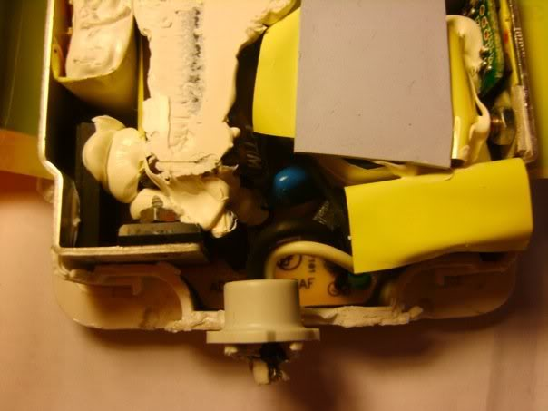

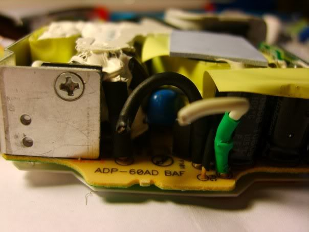

White is the core, black is the shield, terms may be wrong, but essentially, the white wire will be connected to the innermost set of cables, and the the black wire will be connected to the outer cables.

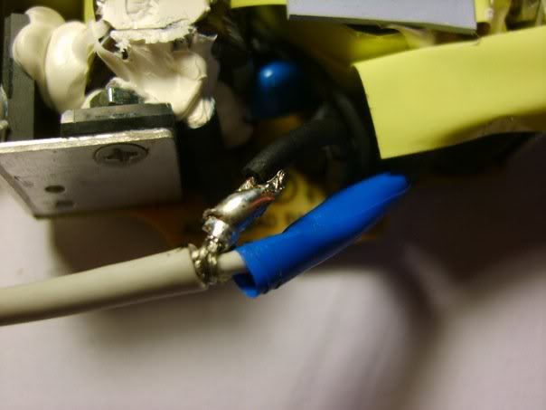
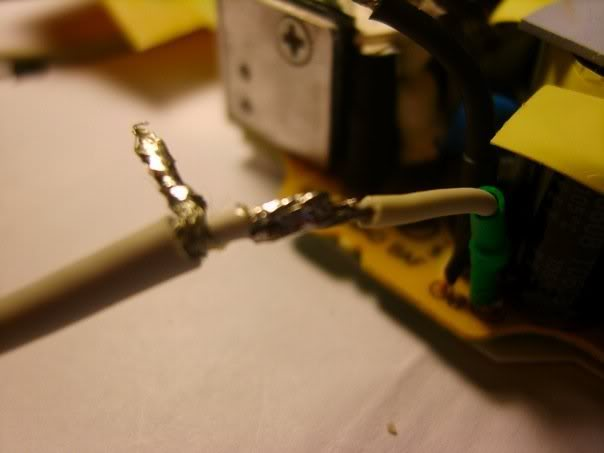

Now, some of my crap soldering. I soldered the core first, then the shield. I wrapped some insulation tape around the core so that the connections didn't touch.

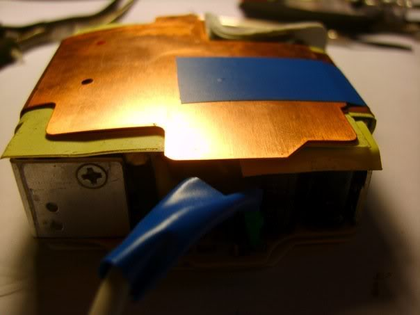

Wrap the copper casing back around the board, I taped it down with some more insulating tape. Carefully putting everything back into the case, I then put loads of insulating tape around the case to keep it all together!

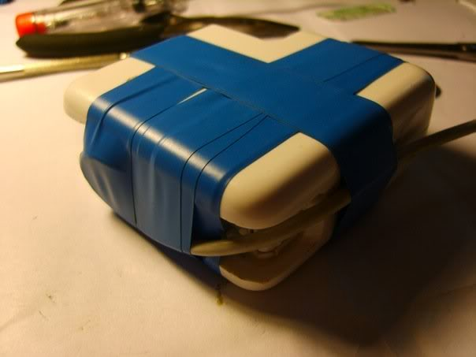
