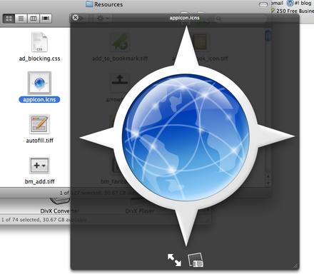

Did you know that you can grab the icons for applications, and then save them as a GIF, a JPEG, PNG or even a PDF?

Go to the Applications folder and select the application you want, right (ctrl)click and press "Show package contents"
<!--more-->

From there, click through any folders until you find a directory called "Resources" In that folder you should find a file called "app.icn" or something similar.

If you double click on the file, it will open in Preview.app, this will reveal several, scaled versions of the image, which you can then File &gt; Save as... to save as you preferred format! Click [HERE][3] for a PNG version of the Mail.app icon.

Also, if the application is on the Dock, to quickly find it, command-click it and you will get a Finder window in the Applications folder, with the said application highlighted! Pretty nifty!

Thanks to the team at [Caminobrowser.org][4] for their browser, the icon used in this blog post is that of the Camino browser.
Also, thanks to Apple for their Mail application!

  [3]: app.png
  [4]: http://www.caminobrowser.org
  [5]: http://www.caminobrowser.org
