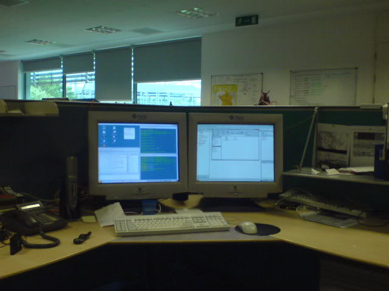
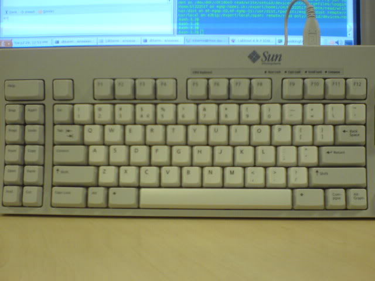
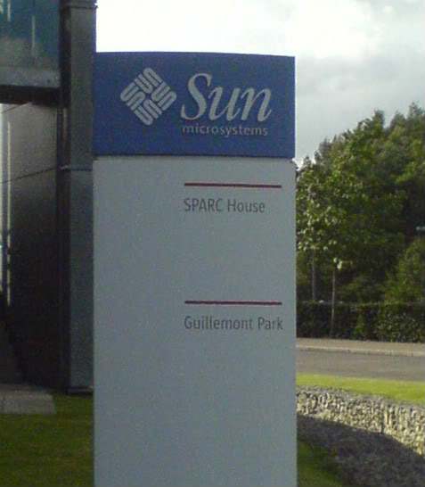
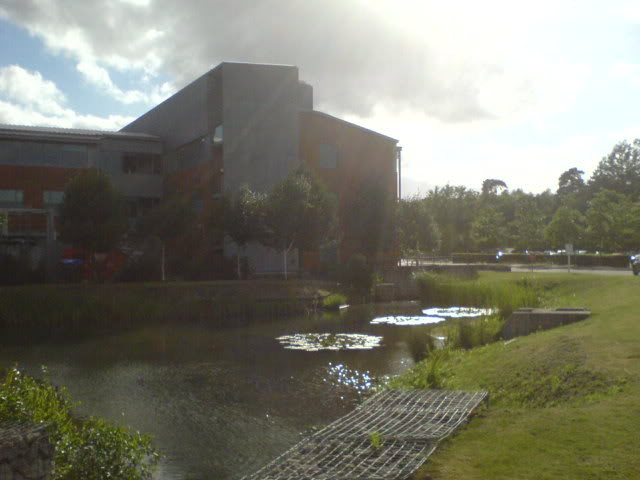
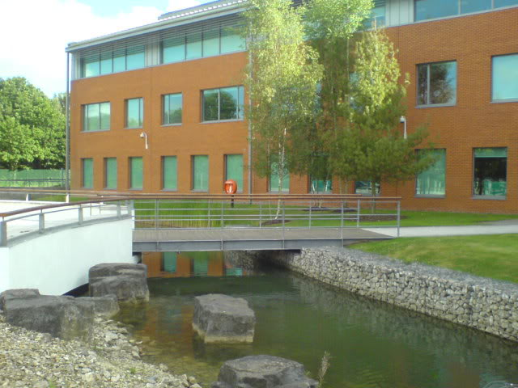

## Monday
When I got into the office today, James had stolen Michael's nice big monitor, and swapped it for a small 17"one. So, after claiming Michael's desk, I set about looking for two CRT monitors that worked, both are about 20", but do consume a lot of desk room. I had to set up two SunRay clients too, one to be a master and control one screen as well as the keyboard and mouse, and another to be the slave, controlling the second screen. I'll try and get a picture tomorrow.<!--more-->  
In the middle of this, James gave us a TOI on servers, past and present, as well as giving us a good, general overview of the history of the SPARC processors.  
The afternoon came and we had our regular meeting, Steve, Tom and myself were asked to relabel some racks, and change the locations of the servers in the database if they had changed. My other task for the week is to localise some documentation given to new interns, I had mentioned it was difficult to follow as the American servers I hadn't heard of, but if they had been localised, I might have understood the document a bit more, so I've got to do that somewhen...

## Tuesday
As promised, I have some pictures for you:

This morning started with a developers meeting, just discussing some of the internal tools used by some of the departments, we spent a lot of time talking about JLT, and a lot less time on the other tools :P
This afternoon was split up with Paul giving us a TOI on the service desk, how to respond well to requests, etc. He also used the time to see how we were getting on and for a chance for us to ask him any questions. After the meeting I gobbled up some tickets for post-bookings. Basically, this is where an engineer has booked a system, potentially modified the spec (more/less RAM, various PCI cards, storage etc.), networked it up with other machines, or in some other was had a play. It is then our job to return the machine to it's original configuration, we always need to have various cards free, so we always need to keep the lab tidy. I spent a couple of hours finding the machine and clearing it, finishing up by putting Solaris 10, update 4 onto it. I have two more to do, so they will get done tomorrow, or by the end of the week.
I finished up the day by pulling some hard drives for an engineer, then replacing them...

## Wednesday
The day started off with me finishing up a post booking, then melted into a TOI with Liam and James about how to book in systems and how to use the barcode. Lunch followed closely after the TOI, so not much got done.
I spent the afternoon in Falcon, one of the meeting rooms, with DC. He was teaching us some of the more advanced features of JLT, this went on for a lengthy two hours! But we learnt one heck of a lot!
The rest of the afternoon was spent post-booking a small server, the name of which escapes me...It was fairly old, and a SPARC system...
In the evening I sat down and helped Steve with some databases. I don't think I should have helped, in my dreams last night, the roads were like conveyor belts (really weird) and as I was walking somewhere I noticed Nigel Hardy bound and gagged just lying on this conveyor belt :? Never fear though, the travelling Sun bus came to his rescue, and me and the driver are going to communicate over ssh....I then woke up and was rather confused with myself...

## Thursday
After last night, today didn't seem promising...It started with me finishing up the last of the post booking for that old system, just jump starting it and one or two minor things, then went over to the O2 lab with DW, we looked at a system who's console wasn't working, and with good reason too, the cable was out! We plugged it in and it didn't work, so tested some other routes, it turned out that the etherlite port had died...We relocated the cable and it all worked, yey! :D
Liam then pulled me over to help organise the installation of some stuff (leads and boards into a system). Then it was lunchtime.
After lunch we went and plugged in more cables as well as did some labelling. After we had finished I started my final post-booking, clearing up a [Netra T5220][3] (telecoms version). It proved a challenge as it used an iLOM, not something I have been trained on, but as I left the office I set it off to jumpstart with Solaris, and got the email confirmation when I got home that it had finished, so all is good :D .

## Friday
That old machine I was on about, it was a[ V210][4]...Just remembered!
This morning went slowly, I had nothing directly to do, apart from finishing up the post booking that finished last night.
I booked out a [Serengeti 6800][5] to have a play with, and to refresh what I learned last week...Then looked at a [T2000.][6]
This afternoon I decided to rekindle some of my UNIX skills, I just edited my crontab file on the uni server, now my website permissions are checked every hour :D I will be looking at doing some more things like this in the coming weeks...
After doing this, I set about looking for more tickets, one brought up a discussion with Liam about subnets, although good, I opted to go and buy 'Networking for Dummies'. I got a ticket to post book a [T2000][7] (just above the one I had booked out earlier), so spent some time booking in a fibre card and some hard drives.
I also took some pictures :D One is of the 'SPARC House' sign, and the other two are of the moat...

  [3]: http://www.sun.com/servers/coolthreads/t5220/
  [4]: http://www.sun.com/servers/entry/v210/
  [5]: http://www.sun.com/servers/midrange/sunfire6800/
  [6]: http://www.sun.com/servers/coolthreads/t2000/
  [7]: http://www.sun.com/servers/coolthreads/t2000/
