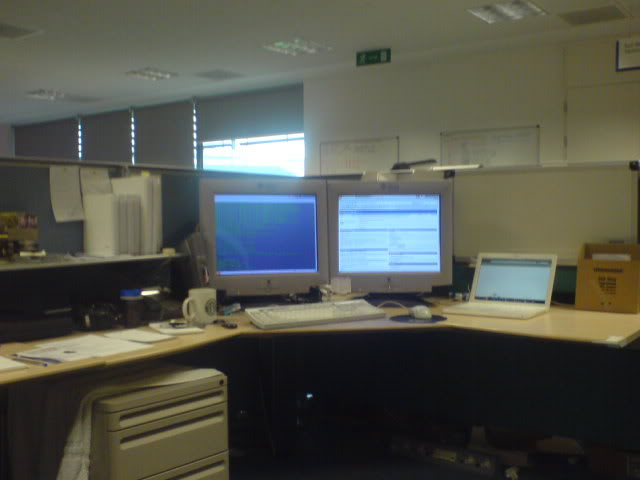
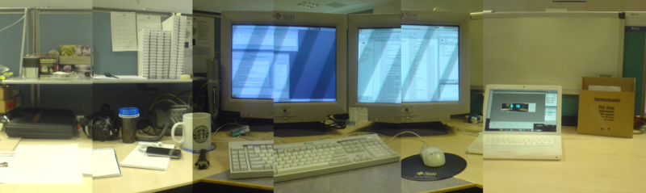

Monday started slowly. I cycled in and not much happened in the morning. By the afternoon I had inherited a couple of tickets which I started work on after lunch.
Immediately after lunch we had the weekly staff meeting, then I got cracking on some tickets...One system wasn't turned on, so I turned it on (very taxing) and I started to look at Liam's ticket about remaining SAN switched.
<!--more-->
Tuesday was really busy. I finally received the RSC for the [280r][1] that I needed. I installed that then headed over to GMP02 to look at a cluster. I had to repair the box after James had maliciously ripped it to shreds...Or rather he had broken a switch that makes the system power off when the lid is removed. I replaced said switch and some gubbins to do with that, then popped the machine back together. Upon completion, it was lunch time :D
After lunch I talked to the guy who has booked the cluster system, but didn't get any time to continue work with it. I had to configure the RSC from the [280r][2] platform, which was weird, and after much fiddling and replacing of cables, I finally got it to work. I have also had to explain how to jumpstart a system to an engineer after directing him to the relevant documentation several times. That's taken a large part of the the afternoon!

Wednesday was taken up completely by the cluster I've inherited from James. I don't know what I'm doing, the engineer doesn't know what is supposed to happen either. The two nodes didn't boot in the morning, and I spent the morning locating firmware images and working out how I could up an FTP service so I could update the firmware on node b.
The afternoon was spent trying to set up the FTP server, which David Cole helped with, and the finally upgraded the firmware. Then there was the problems with node a. It just wouldn't get to OBP, it was really annoying. I reinstalled the firmware, but to no avail. It was home time before I got it working, so more fun on Thursday....

As promised, more [T2000][3] fun on Thursday. I ran the max verbosity, max diagnostic levels of POST, with no clue as to why this system won't boot. While I was letting the POST run, I tidied and rearranged my desk:

The afternoon was spent trying to troubleshoot further, to no avail :(

Friday morning was spent on getting this system to work. In downgraded the firmware, upgraded the firmware and a number of other things, but nothing has happened :( It is currently mid afternoon and I have a splitting headache. I can't wait for home time so I can see my Faye :D And Aled is coming down too!

  [1]: http://www.sun.com/servers/entry/280r/
  [2]: http://www.sun.com/servers/entry/280r/
  [3]: http://www.sun.com/servers/coolthreads/t2000/
