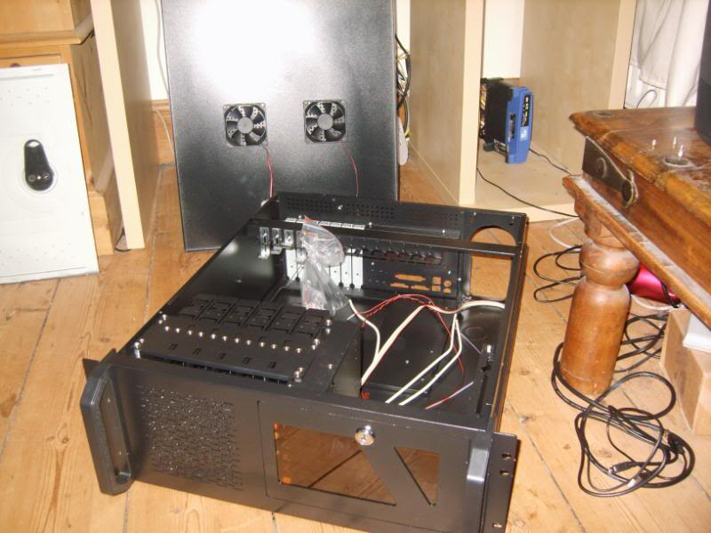
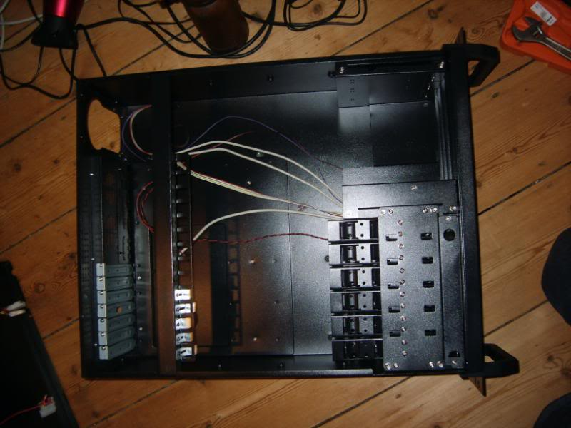
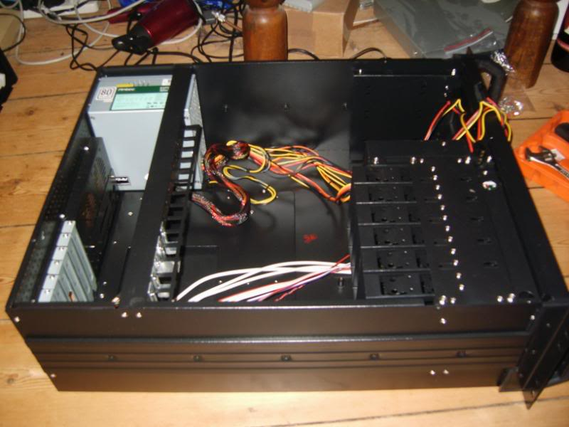
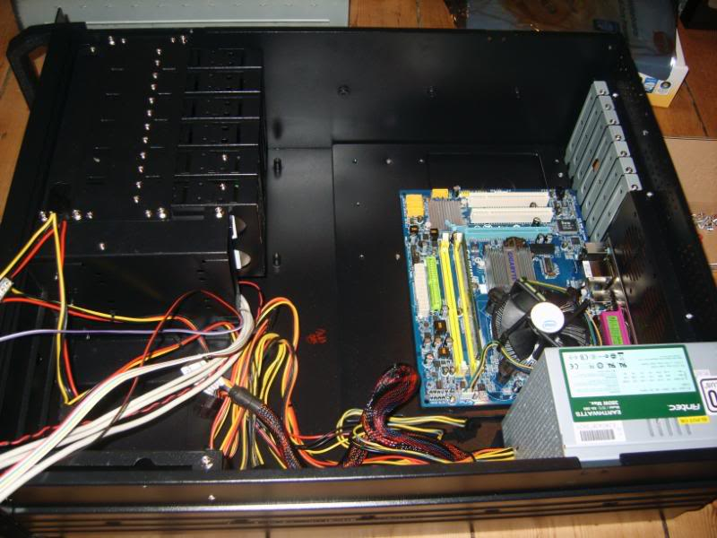
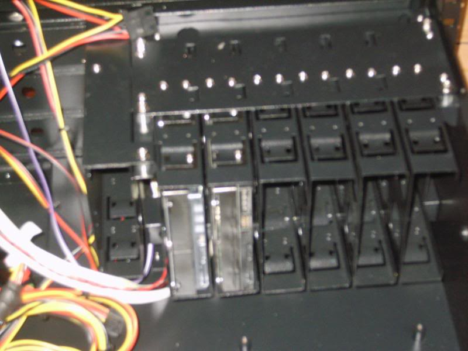
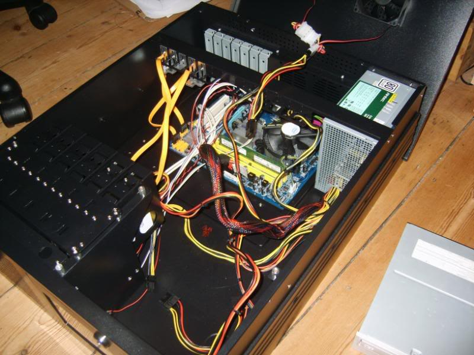
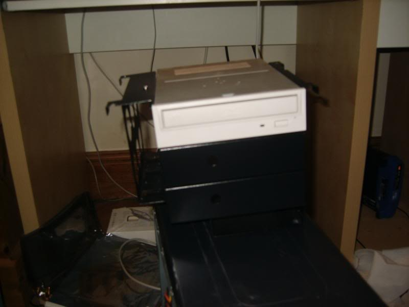
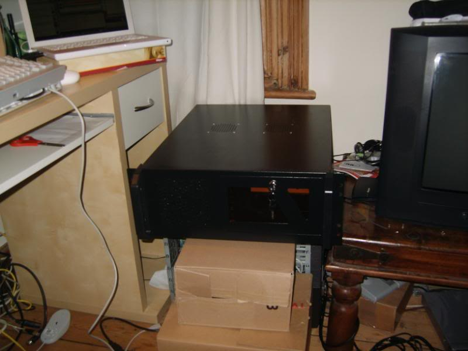
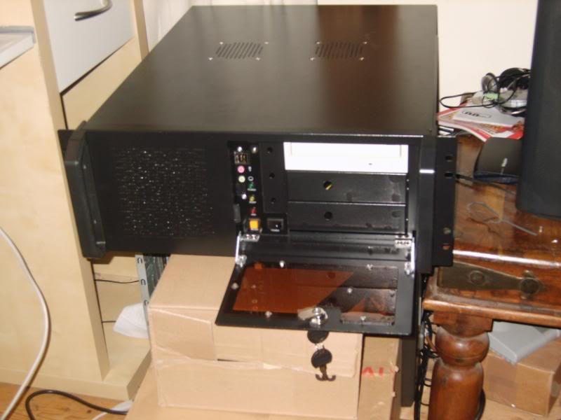
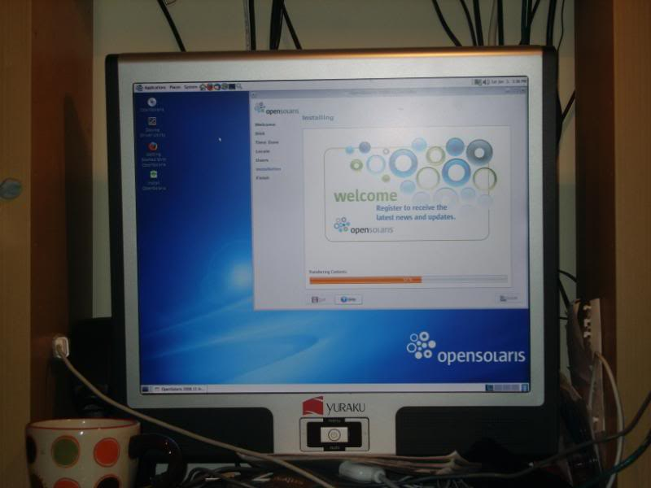

So, I had ordered the parts and the parts had arrived.  I was very good, although everything was with me by last Tuesday, I refrained from building them up until Friday.

So this is my new case:

It's a nice size, you can see the six brackets for hard drives in the bottom-left of the second picture, just up from those is a seventh bracket, above that there are three spaces for DVD/CD drives or for fan controls etc.

I first fitted the PSU, a 380W Antex recommended to me due to it's 80%+ efficiency rating.

Next came the motherboard and hard drives, look how dwarfed this Micro-ATX board looks in this case!

The hard drives are screwed into the bracket and then the brackets are screwed into the chassis.

The above picture shows all the wiring complete

Here is my DVD drive mounted in it's bracket.  A nice black DVD drive would have been nice, but a white one was all I had to hand.

So, boxed up and all plugged in, it looks a bit like this:

And here it is, halfway through the OpenSolaris Installation:

