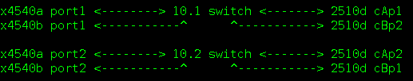

The weekend was great. Faye came down on Friday and went home on Sunday, we had a really nice, weekend doing not much. Parents came round on Saturday too to show Faye the photo scrapbook Mum had made me for my birthday.

Monday I worked on a ticket which I had picked up last thing on Friday. It was to install four network cards into a T2000. The T2000 booked was on the back bench under a 3310 array (or something similar). Since my engineer had a genuine booking, I disconnected the T2000, put it back in it's place and set about taking out old cards and adding in the new ones.
When I came across problems with the SP and asked for help, it transpired that the machine actually belonged to someone else...Tom had cancelled the booking, and I had dismantled the config. I hastily set about undoing what I had done to some success, I emailed the original owner and apologised.

Tuesday I had a ticket from an engineer who wanted some extra disks in an x4100, however, these machines take two hard drives and a DVD drive, or four hard drives, but you must specify when you buy the machine. We looked for some others but he finally got a machine in the US, so it was all out of my hands.
I also found out why my X2200 wasn't booting using the internal disks! I had placed the connections from a RAID card to the system board, the card took SAS disks but the system board only takes SATA, both are electronically the same, but I guess signals are different. Anyway, one mystery solved!

Wednesday was surprisingly busy. In the morning I installed some fibre cards and cabling from a V215 and a switch.
This was followed another remote engineer requesting me to pull some drives from an array.
Also, I moved the array and card from that X2200 to another few machines (an X4140 and an X4600).
I installed a SCSI HBA into a V250 and hooked it up to some storage.

Thursday felt like an extension of Wednesday with the frenzy never ending. I started by cabling up a couple of 280r's to a storage array (2510). The same engineer was asking for two HBS's in a couple of x4540's and after lunch, asked me to uncable the original setup and bale both the 4540's to the array. He later asked for two switches to be introduced and wired like so:

I helped an engineer netboot a machine, the Ethernet was wrong in NIS+ so the netboot timed out, I corrected the entry and it was on it's way.

Friday morning I came in and started work no a stable machine that was stuck in continuous netboot. I reset the BIOS to boot from the HDD and then jump-started it with Solaris as asked by the engineer. The morning also brought problems with the x4540 and 2510 setup. After some fiddling we found that the array wasn't configured as it should have been, so we rewired the network to match.
In the afternoon I spent quite a lot of time over in the 02 lab. I was inserting fibre cards into a couple of machines, an x2100 and a v120. Unfortunately there was no fibre switch over in that lab, so on Monday I've got to move the cards to other machines in the 03 lab.
