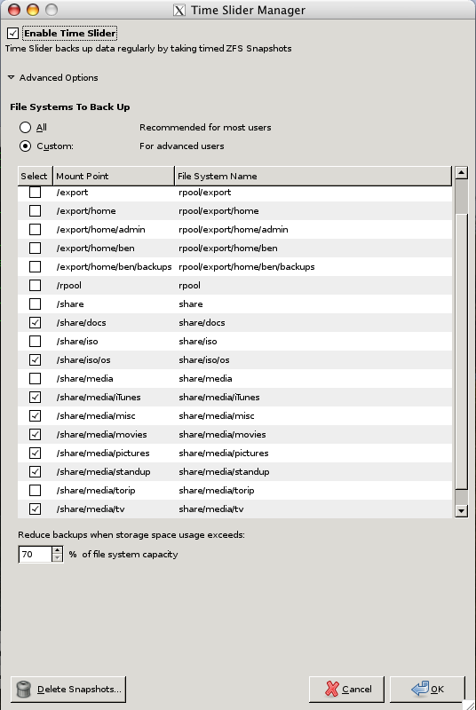

It happened a couple of weeks ago now.  I plugged in my external hard drive "POCKET" and OpenSolaris mounted it under `/media/POCKET`.  I was going to copy my films and TV series over to POCKET as I was travelling up to see Faye in Aber.  
<!--more-->
I started the copy from my Mac, however halfway through my Mac crashed :(  After a restart I decided to start the copy again.  So, my plan was to cd to POCKET and `rm -rf` everything...However, by some horrible fate, I typed the path to my media folder by default and went ahead with `rm -rf *`.

I only noticed about 30 seconds later what was happening...Bit by bit, my data was being de-referenced, left for ZFS to write over it with something else...My first thought was "It's OK, I've got a mirror!", however, the mirror is, of course, in real time...My second thought was "ZFS snapshots!", however, they are not enabled by default :(



I have spent the last few weeks slowly re-ripping my collection (though thanks to James as he had copies of a lot of content), I've still got a few to do, but I'm mostly there.  I turned on ZFS snapshots too.  I access my server though SSH from my Mac, so here's what I did:

```
ben@faegilath>$ ssh -X beleg-ia -l admin
Password:
admin@beleg-ia:~$ time-slider-setup
```

I was then presented with the screen on the left

As you can see, you can just tick the box saying "enable time slider" and the choose to snapshot all file systems or select what file systems you do want to snapshot.

