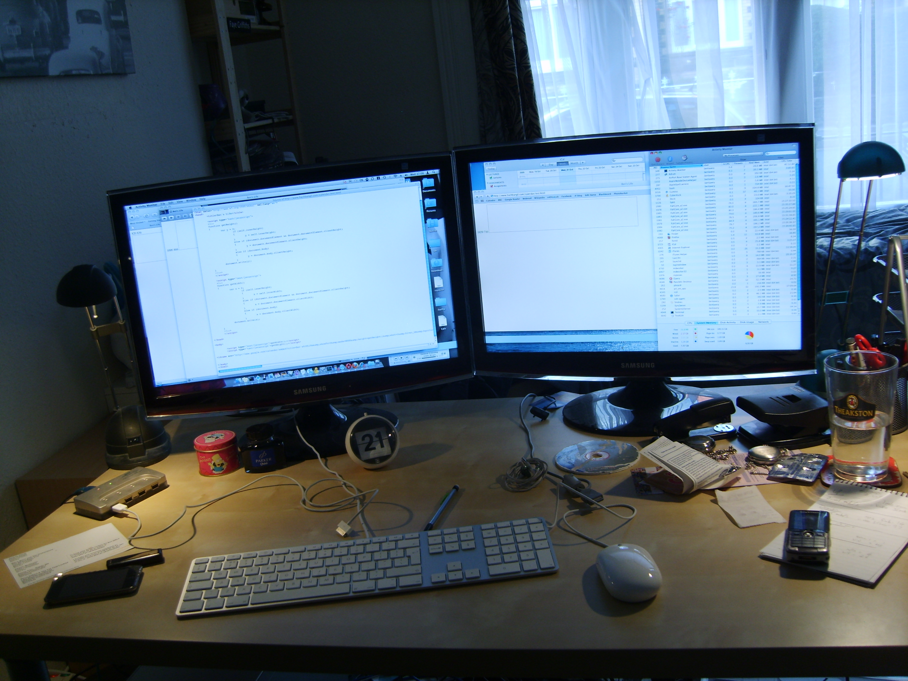
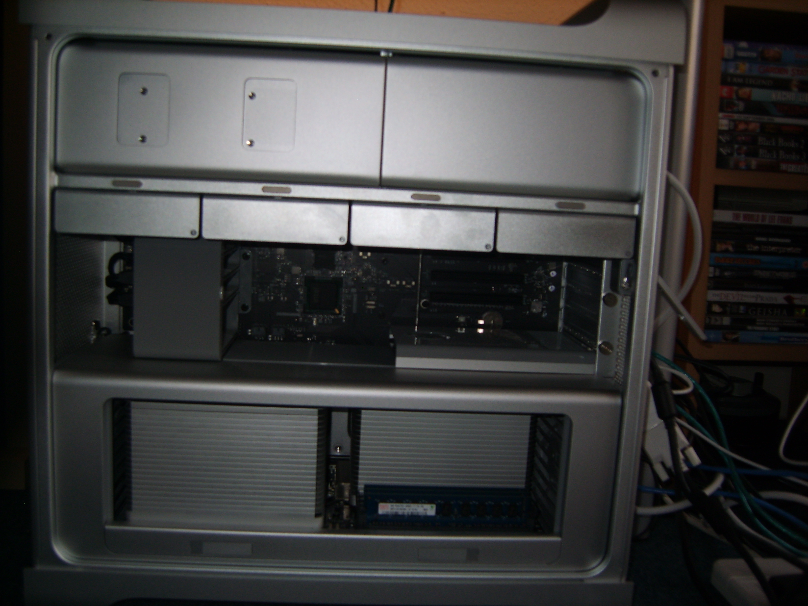
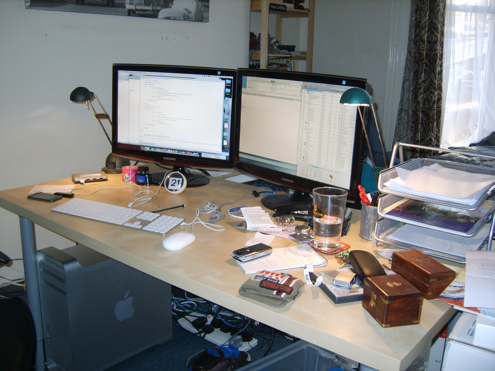
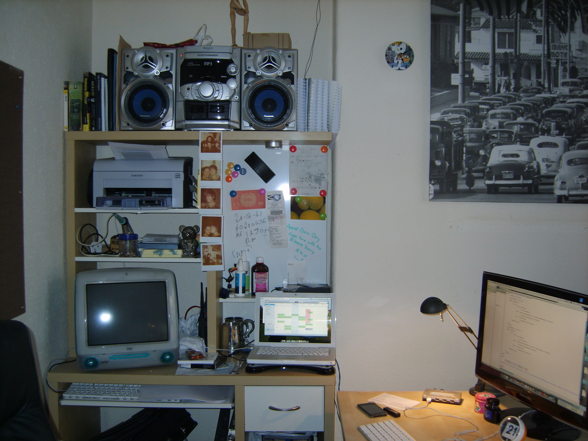

Well it's been a while since I last posted here.  Though it'd be right that I come back with tales of new desks, screens and computers!

So what's new?  I've left Camberley, worked for the MoD over the summer and am now back in Aber living with Faye ([hopefully a film of the flat coming soon][1]).  Since being in Aber I have bought a new desk, a new chair (which is annoyingly not here), a pair of new monitors and a new shiny computer.
<!--more-->
Let's talk about the monitors to start off with, two 22" things from Samsung (SyncMaster T220 apparently), here they are:

As you can see from the picture, a nice wide desk that is also quite long.  Plenty of room for lots of crap!

So, that are these screens attached to?

* 2 x Quad-Core Xeons (5500)
* 6GB of RAM (DDR3 1066MHz)
* 3 x Hard drives, (1 x 640GB, 2 x 500GB)
* NVIDIA GeForce GT 120
* 2 x DVD ±RDL/DVD ±RW/CD-RW drives
* Wi-Fi &amp; Bluetooth
Guessing that you've either heard me shout it about, or have guessed that, yes, it's a [Mac Pro][3]!  Here's some pics of it:

I do love it,  I've quickly found that 6GB of memory isn't very much at all, not once you start ripping DVDs and starting up virtual machines....I've found that the 64-bit apps do run quite a bit faster, and don't really take up much more memory than their 32-bit equivalents.

I still have my trusty MacBook, I'm running [ChronoSync][5] to keep the two machines in check, though I'm hoping to develop an open alternative in the next year or two.

Some last pictures before I finish this off, one of my main desk, and another of my desk from last year:

  [1]: http://www.blog.hashbang0.com/2009/11/13/our-flat-in-aberystwyth/
  [3]: http://www.apple.com/uk/macpro
  [5]: http://www.econtechnologies.com/pages/cs/chrono_overview.html
