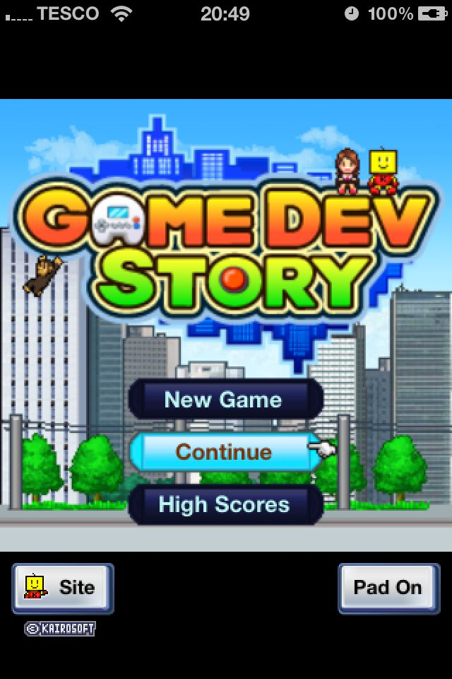
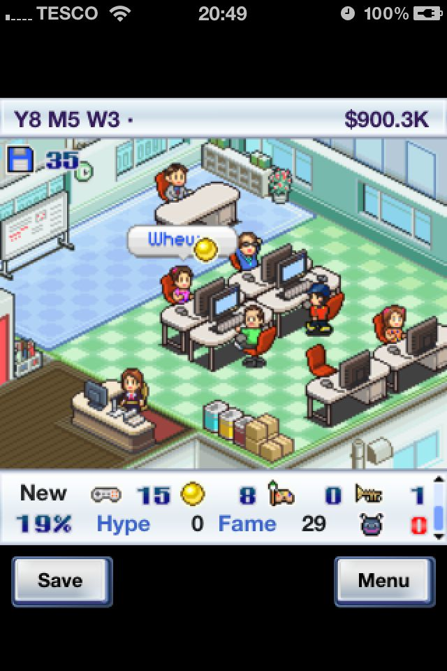
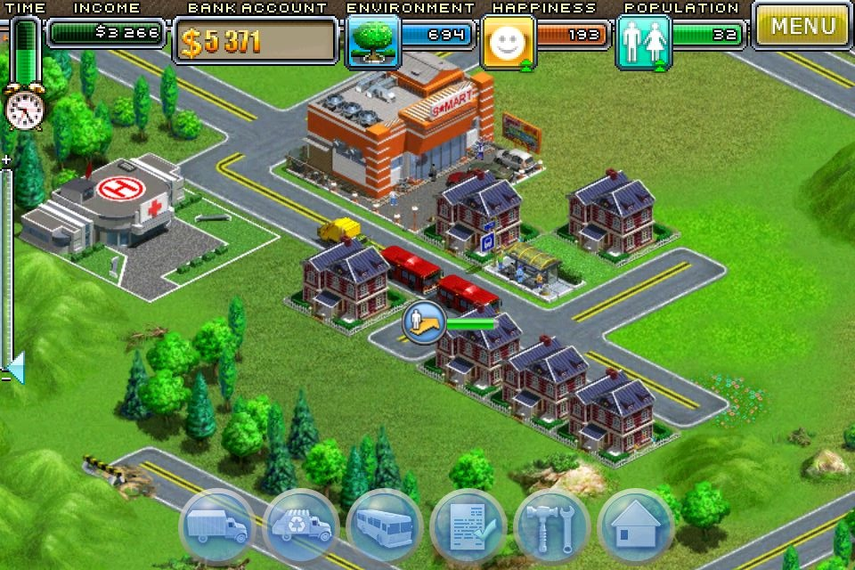
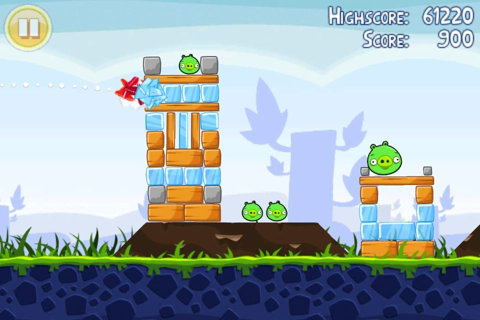
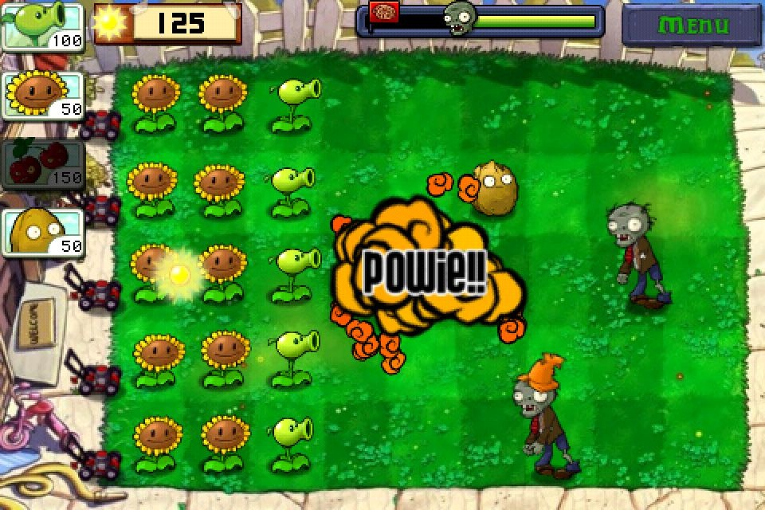

Even back on my iPod Touch I liked playing games, and now with my faster, more responsive iPhone I love playing games.  I thought I might share a few of my favourites.  So here we go, in no particular order (other than in the rough order I last played them).

### [Game Dev Story][2]

This game allows you to control a game dev company.  You start out with two members of staff and a small startup capital.  You must develop games and negotiate contracts to earn more money.

Games are built by selecting a platform to develop for (e.g. PC), a genre (e.g. racing), and a type (e.g. monster) and then working design of various aspects - first comes initial planning, then graphics design, and finally sound tracks - this is done either by members of your own team for free (well, included in their salary), or by outsourcing the work at an extra cost.
Your developers work on the game over a period of time adding fun, creative, graphical, and sound 'points' to the game - the more points the better the game.  You can use object to boost certain points by using Research Points, these are acquired by your staff while they are working.

Contracts are an easy way to get money.  Contracts are made up of two things: a time frame (number of weeks), and points (e.g. fun points).  Set your developers to work and watch them bash out the points in the allotted time, if you miss the deadline the contractor will not use you again!  Different jobs pay a different amount of money, and it's not always proportional to the amount of work or time constraints!

You get to control most aspects if your company, the hiring, firing, and training of staff members.  What advertising happens, and whether you go to game shows.

All in all I think this is a great game, it must be seeing as I spent over four hours playing it last night!

### [Virtual City][5]

Another simulation type game here.  In Virtual City you move into different towns and correct what is wrong with them.  Some towns require you to build roads to neighbouring towns, others require you to set up manufacturing plants, while others need a population boost and more cash.

The challenges are simple to achieve, yet the game isn't boring, you quickly move from town to town solving problems.

In the screenshot you can see three icons near the top, these are indicators of the current environmental rating, population happiness, and population size.  Getting a good environment rating boosts the population happiness and size.  The more people you have in your town, the better use you can make of busses to transport them to the local mall or theatre - The ride gains you money as does dropping them off at their destination.

Building the required manufacturing plants is easy, simply select the building from the build menu and plop it down on a free plot.  Ensure the plant gets everything it needs by transporting goods from other plants (e.g. a plastic plant needs oil from the oil derrick).  You can purchase and upgrade trucks to transport goods from one plant to the next, or to another town, or finished goods to the mall.

This is a great game for short and long periods of time, I've been playing it over the past couple of weeks on the way to and from work on the train.  It also has great iOS 4 multitasking support meaning that the game gets paused and you can resume right where you left off.

### [Angry Birds][7]

Angry Birds has been all over the Internet for months.  As many people will know, the pigs have stolen the birds' eggs and the birds are not happy.
Using a slingshot, hurl the birds at the pigs and the structures protecting them to destroy them and to rack up the points.

Again, with great iOS 4 multitasking support, this is an excellent game to stop and start throughout the day, especially when you are doing testing which requires a ten minute gap!

### [Plants Vs. Zombies][9]

Another great game.  This can also be played on PCs and Macs through [Steam][10].

The story behind the game is that zombies are invading your garden, you must therefore plant a variety of flora to protect your house and fend off the unwanted visitors.

The game goes through different times of day and includes the back garden swimming pool, each scenario limits what plats you can seed.

This games takes a bit more planning than others and it's best suited for longer periods of play - in my opinion.

### And there we have it

Four of my current favourite iOS games shared with the world.

  [2]: http://itunes.apple.com/gb/app/game-dev-story/id396085661?mt=8
  [5]: http://itunes.apple.com/gb/app/virtual-city/id372595983?mt=8
  [7]: http://itunes.apple.com/gb/app/angry-birds/id343200656?mt=8
  [9]: http://itunes.apple.com/gb/app/plants-vs-zombies/id350642635?mt=8
  [10]: http://store.steampowered.com/app/3590/
