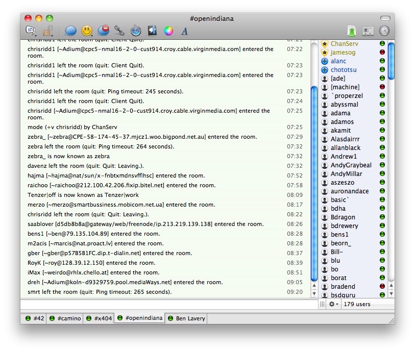

[Adiam][1] is an awesome app for OS X which is based on the same code as [Pidgin][2].  Adium has the advantage of being the same as many other open source instant messenger clients out there as well as being coded specifically for OS X and all the Aqua goodness one could ask for.
<!--more-->
The latest release of Adium ([v1.4][3]) was let loose on 31st October this year and touts the following changes:

* Requires Mac OS X 10.5 or later
* Added Twitter
* Added IRC
* Greatly improved group chats and group chat bookmarks
* Updated to libpurple 2.6.6 with added fixes
* Mind-bogglingly large number of enhancements and bug fixes
The addition of IRC is one that I am really excited about.  For over a year I have used the OS X app called [Colloquy][4] and I really wish I could say it was good, but it really leaves a lot to be desired.  It's a fine IRC client, just a terrible attempt at creating an Aquafied interface.

For long time users of Adium, IRC feels natural, it feels like a group chat and it really works.  Throw in tabbed conversations and you can switch between IRC channels, MSN chats and other features.  It's a great addition to an already brilliant app.

  [1]: http://adium.im/
  [2]: http://www.pidgin.im/
  [3]: http://trac.adium.im/wiki/AdiumVersionHistory#Version1.410312010
  [4]: http://colloquy.info/
