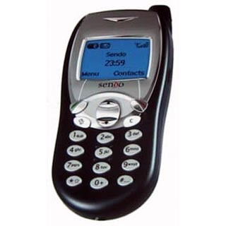

The other evening Faye and I watched the film, [Cast Away][1].  I didn't watch the whole film, but the overall plot was man gets stuck on island, everyone thinks he's dead, he comes back after five years.

I started to think about what it would be like if I had found myself left on a deserted island five years ago (2005), what sort of technology would I have missed?
<!--more-->
To set the scene somewhat, in late 2005 I was a second year Sixth Form student studying for an AVCE in ICT, an A-Level in Music Technology, and an AS-Level in Economics.
I had recently built my first computer, a Pentium 4 with a whole 1GB of RAM and a Club 3D GF7300GS graphics card, my mobile was a Sendo S230 and was rarely used.  I was being educated using the Microsoft environment, Windows XP, Office, Visual Studio, with some Adobe CS2 stuff too.  I was using a mixture of old System 8 Macs and newer eMacs running OS 10.3 in the recording studio.

Back in 2005 Apple was still using PowerPC processors, was selling OS 10.4, Tiger, and was enjoying the boom of the iPod in the forms of the Classic, and the newly introduced Shuffle and Nano (which replaced the Mini).  Microsoft was still plugging Windows XP, Office 2003, and Internet Explorer 6.  Flash was still a part of Macromedia and Adobe had nothing to do with it.  Mobile phones were getting polyphonic ringtones and flashy colour screens, but were still quite primitive.

Had I gone missing around November 2005 and been found a week ago, I may be sitting here now wondering why all of my friends had deserted MySpace, or why the Dennis forums didn't work the same as they once had.  Using my old Sendo S230 I might finally find that friends were now on this site called Facebook, a site made for all sorts of social interactions from leaving private and public messages and instant messaging, to playing games and sharing photos.  Of course I may still be getting used to this iPhone that has been placed in my hand, baring in mind my old Sendo had basic functionality (phone, text, simple games, stop watch, etc) and that I would have been removed from similar technology for five years, an iPhone would have been a wonderful and surprising leap.
Looking across someones shoulder I might see a stylish board which gains input through the screen, this device would have been an iPad or some Android clone, had I seen this device before a new laptop I would probably run to the window to see if people were riding flying cars thinking "Just how much has technology advanced?".

I would have completely skipped Windows Vista and might have been quite happy to sit down at a Windows 7 box, Windows 7 might even be running on a Mac, what the hell would I think then!?  Just a few months after I had disappeared Apple would announce a transition to Intel's CPUs allowing users to run Windows.
Back in 2005 CRT monitors still dominated most of where I looked, today I can't say when I last saw a CRT monitor in use, it might have been back when I worked at Sun...

Today mobile technology is so much more advanced, just look at smart phone hardware and software today, 1GHz chips and hundreds of megabytes of memory.  Five years ago those sort of specs wouldn't have been terrible in an office desktop...
My iPhone has 16GB of storage space, compare that to my old Sony Ericsson which had a measly 256MB.

Granted the last five years hasn't been the most exciting with regards to technology, but I think many people are happy with the progress.  Multi-core chips and more advanced operating systems help people work faster every day, mobile phones now manage our emails, calendars, and provide us with relatively powerful computing power on-the-go.
The next five years could see everything doubling or more in power again, I think we might see more tablets come into use, though they may be a fad...No one knows!

  [1]: http://www.imdb.com/title/tt0162222/
