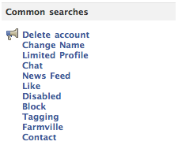

It seems that everyone is having some problems with Facebook at the moment.  They are getting notifications saying someone has written on their wall, but find that their wall hasn't been updated for a week or two.

I have been bitten by this oddity and decided to vent by filing a bug report.  After navigating to the Facebook Help Centre I had a quick glance at the "Common searches" box.  Here is what I found:

How fantastic is that?  The most searched for articles are about people leaving Facebook, or trying to keep a hold of what privacy they have left!

Facebook is one of the most, if not _the_ most, popular social networking sites on the web.  However, with the site increasingly opening up people's data and it's recent instability, it is getting more and more of a bad reputation.
