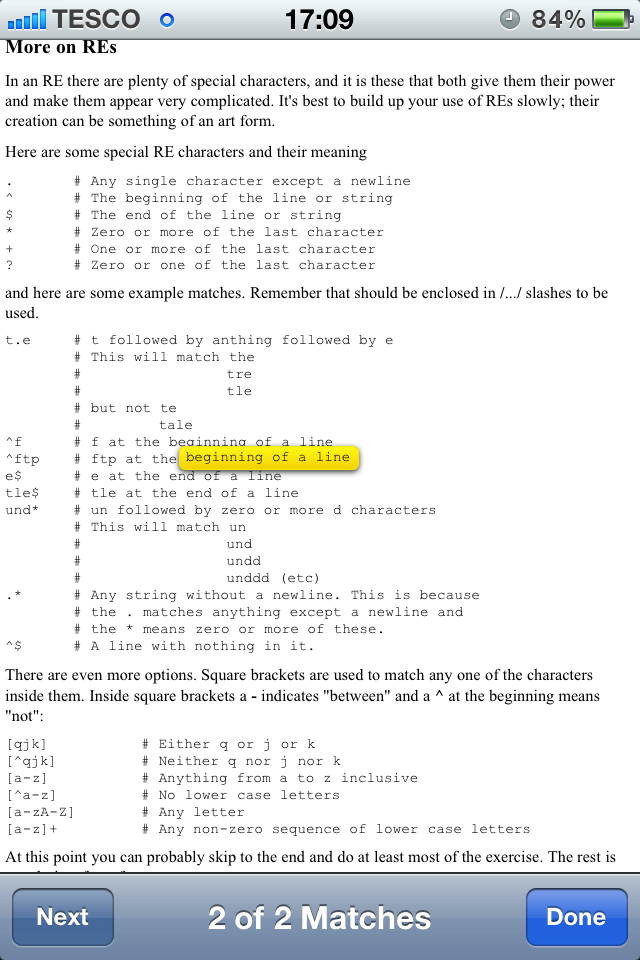

Have you ever used your iPhone to search Google for something, then find that the best link is a huge page?  On the desktop you'd hit cmd+f to search on the page, but in the iPhone this luxury isn't immediately obvious. 
 <!--more-->
It is, in fact, really easy.  Go to the page you want to search on, then click on the search box in the top right.  Type in your query and wait for the text "On This Page" to appear: 
 

 
Click on matched text and you're given this view: 

 
Simply click the "Next" button until you find the text you're after!
