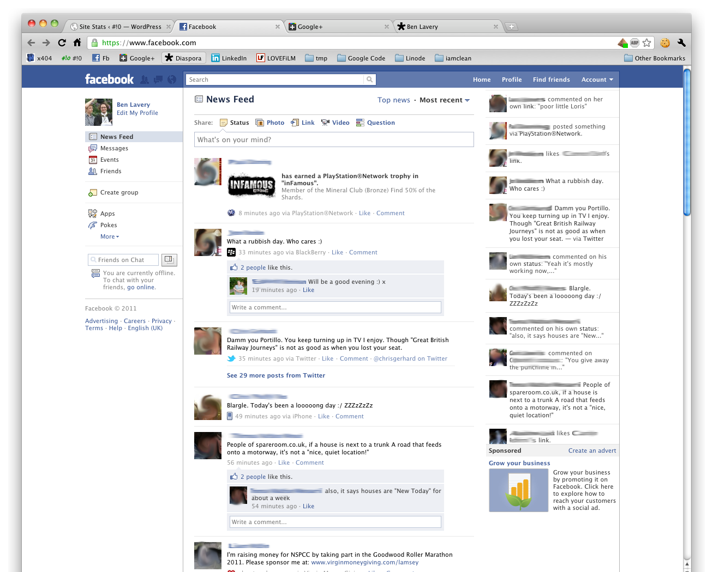
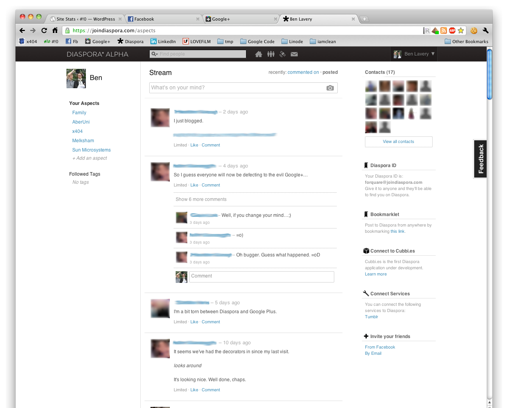
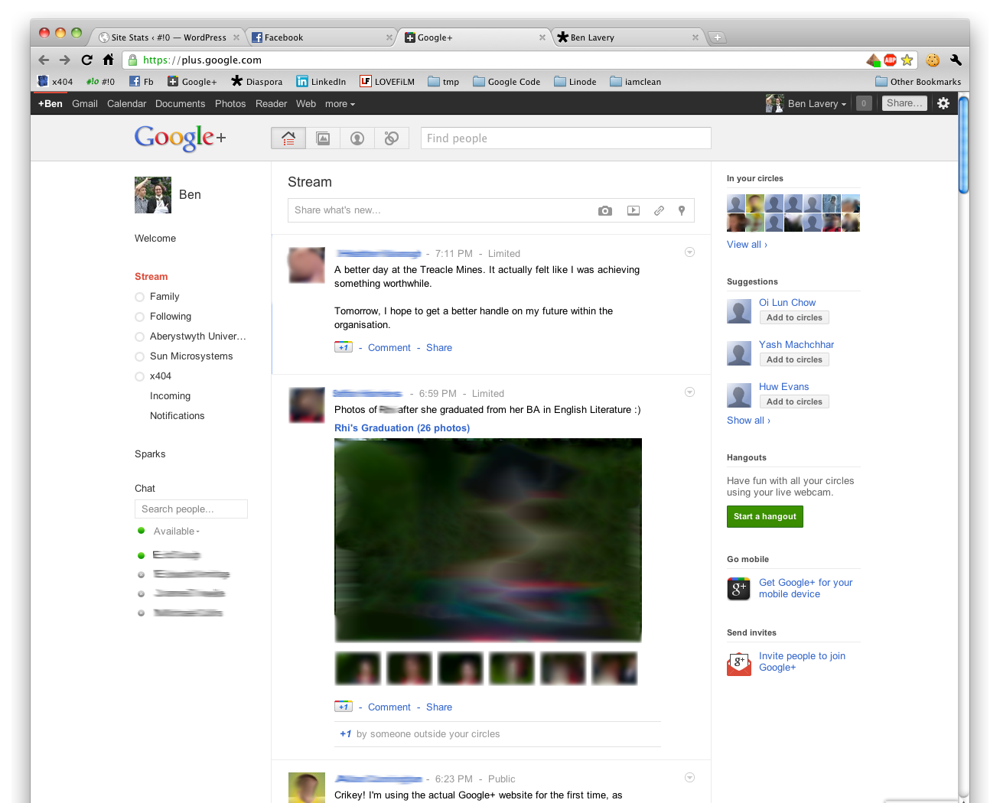

The social networking world is rather turbulent at the moment, with Google barging in to rival Facebook. 
<!--more-->
 

Until recently, [Facebook][2] went unrivalled.  From humble beginnings as a networking tool for uni students, it is now to the social networking world as the iPod is to the MP3 player. 
 
Facebook has always had some use, it is not merely for posting on a friends profile, but for organisation.  You can organise events, be reminded of a friends birthday, categorise and tag friends in photos and videos and notes.  It has also added APIs for developers to add content and use to the site.  These organisational features are what make Facebook great to use, but many would argue that Facebook has become something of a monster... 
Facebook is dominant, it hasn't needed to care for users.  In the past couple of years we have heard story after story about Facebook reducing the amount of privacy users get.  External developers have turned malicious and targeting unwary users into clicking links that SPAM walls and streams or worse...Other people can't get off Facebook, insistent that they must water their crops on the latest farming craze, or go into battle with the bloke from a different timezone. 
Functionally, Facebook is very different to how it was.  A simple PHP page with refreshes when adding/removing content have been replaced with wizzy, and often buggy, dynamic Ajax scripting leaving users with odd errors and half loaded pages. 
 

[Diaspora\*][4] is an open source social networking engine.  It aims to create social networking with privacy being one of the key features. 
Currently in [alpha][5], I was lucky enough to get an invite several months ago.  It has come on leaps and bounds since I joined back at the end of December, it also uses some wizzy Ajax scripting, though it appears less buggy. 
One of the best features is the aspects.  You can configure as many or as little aspects as you like and add friends into one or more of them.  You can then publish a post into just a selection of aspects, or make it public.  This approach has two major benefits, one is segregation of information with regards to interest (your vegetarian friends may not want to know how you've just gutted a deer after your hunting trip), and the second is privacy (you may not want family members to see those drunken, late night posts in freshers week). 
The problem with Diaspora\* is that it is being developed really slowly.  It allows all of the staple features, private messaging, stream, photos, etc. but it lacks the organisational features of Facebook, making it difficult to organise a party or tag people in photos.  It also lacks a rich developer community who can functionality and features to the site in the form of applications. 
 

[Google Plus][7] is the latest social network on the scene (closed [beta][8] available for use at the end of June). 
It bears a striking resemblance to Diaspora\*, in fact if you have the same friends posting the same thing, you'd be forgiven for forgetting which site you were using! 
The features are similar too, aspects are replaced by circles which do exactly the same thing.  Photos can be tagged in Google+, private messages can be sent, etc. 
I'm hopeful that Google+ will become a valid rival to Facebook.  It is clean, fast, and very wizzy (lots of drag and drop type stuff), and it works!  Yes it's a tad sparse at the moment, but it's backed by Google who will hopefully run with it. 
 
Ultimately it would be nice to have a single social networking engine upon which Facebook, Google+, Diaspora\*, etc. could run on.  You'd have complete integration of services and you'd just have to choose the application you'd access it through, much how email works with the various service providers and applications, it all just works (well, most of the time).

  [2]: http://facebook.com
  [4]: https://joindiaspora.com
  [5]: http://en.wikipedia.org/wiki/Software_release_life_cycle#Alpha
  [7]: https://plus.google.com
  [8]: http://en.wikipedia.org/wiki/Software_release_life_cycle#Beta
