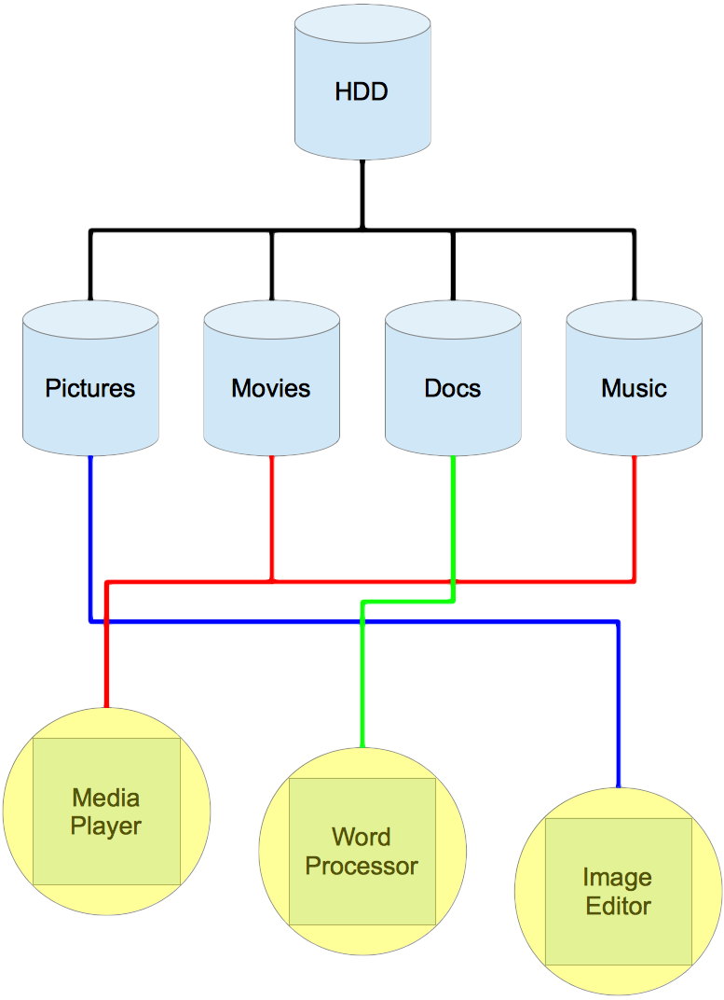

Back in 2010 I complete my [dissertation][1].  The idea for my diss came to me while sitting in Starbucks in Camberley sometime during my time at Sun Microsystems, probably early 2009.  The idea was quickly jotted on the back of a Starbucks serviette. 
<!--more-->
Applications crash and can take down a system, if we could virtualise the application and separate it from the system then it couldn't bring it down.  This was the subject of my diss and I mostly implemented it using OpenSolaris Zones. 
 
The idea was more than that though, I thought that files should also be chopped up and placed into separate areas (at the time I was thinking separate ZFS file systems).  Separating files into types would mean that one could limit what information applications could get hold of (why would an image editor need access to word documents, for example?). 
Here's an image to somewhat illustrate my point: 
 

 
Now, back in 2010 I used the phrase "Virtual Application Environments".  Today I feel quite silly, as everyone simply calls it "sandboxing", Wikipedia has this to say about sandboxing: 
> a **sandbox** is a security mechanism for separating running programs. 
My diss somewhat successfully implemented sandboxed applications, but these apps had access to the whole of the current users home directory, so obviously didn't implement the second part of the idea... 
 
What is interesting is that this is sort of how the iPhone works, in so much as there are documents, photos, movies, music, and the user only really sees these through specific apps - so the Photo app doesn't view documents, and the iTunes app doesn't view photos, etc...And now a similar thing is happening on the Mac with the Mac App Store. 
 
A short while after I had this idea in Starbucks, I began to think about how users could use a thin client (like a Sun Ray) and access sandboxed apps, running inside virtualised machines, running a variety of operating systems, all being able to access segregated file systems for different file types. 
 
Let's have a think about that.  A thin client connects to a main server, this server can then connect to other systems (virtual or otherwise) and run apps from those systems.  Apps on the remote systems are sandboxed for security and stability.  All the while the user thinks that they are using a regular computer. 
 
Now I'm very excited!  OnLive have released a product called [OnLive Desktop][3].  It allows you to access a MS Windows 7 instance from a tablet, right over the web.  So we begin to see this thin client (iPad) access a remote system (Win 7) to run apps.  All we need now is for the Win 7 instance to be able to run a multitude of Linux and OS X apps (by somehow forwarding the app from the Linux/Mac system to the Windows system (something like X11 forwarding)) and my idea would have become a reality!

  [1]: /2010/05/31/dissertation-is-over.../
  [3]: http://desktop.onlive.com/
