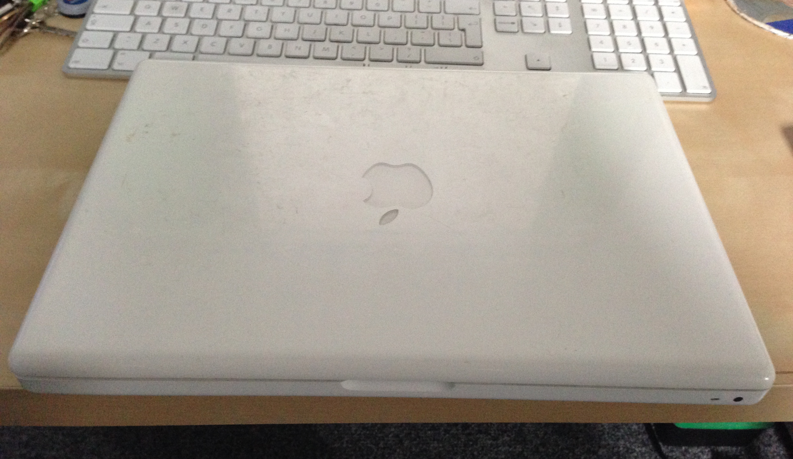
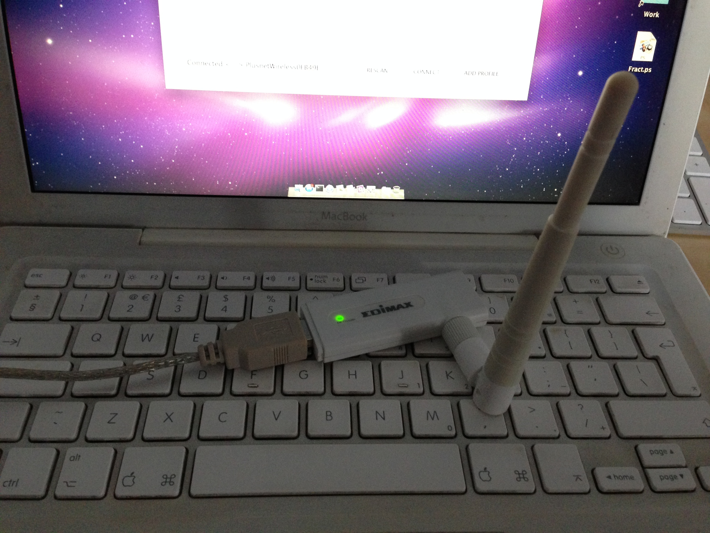
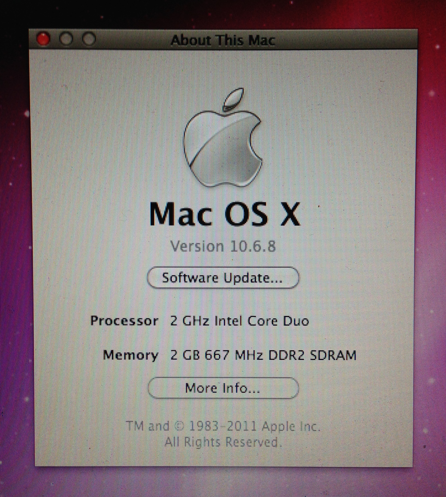
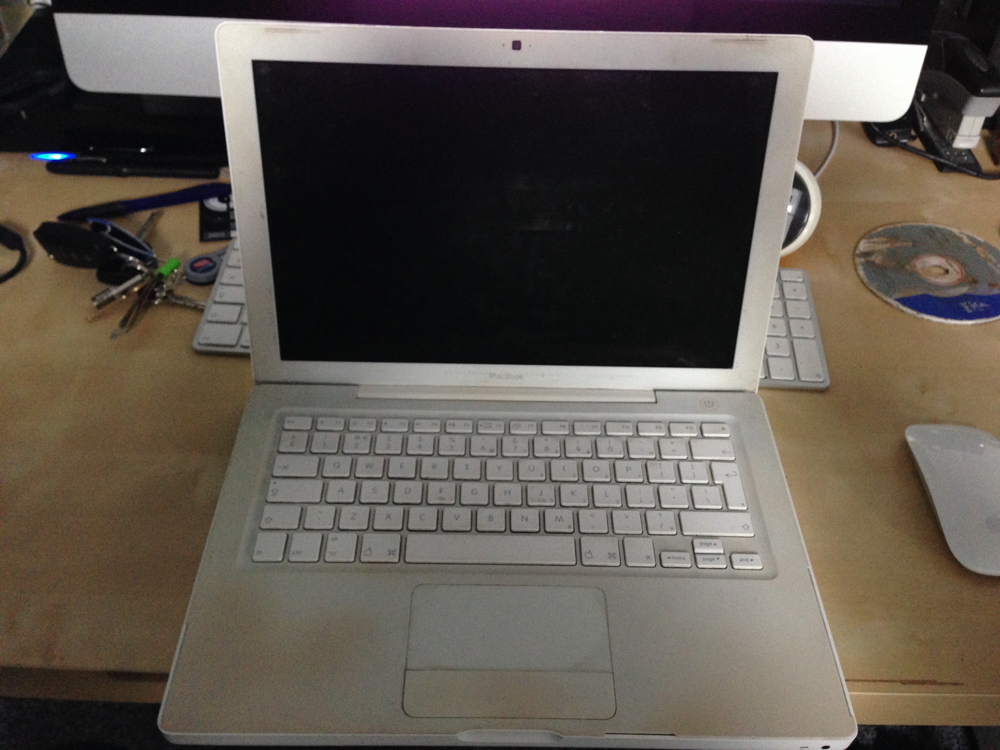

Technology moves so fast, doesn't it?  I mean who would want such a battered looking laptop? 
<!--more-->

 
It doesn't look like much, does it? 
 
This first generation MacBook has been in my possession for eight years today.  Setting me back just a little over  £900 at the time for 1GB RAM, a dual core (32-bit) CPU running at 2GHz, and OS X 10.4 Tiger. 
 
I bought the MacBook for two main reasons 

1. I wanted a laptop
2. I wanted a Mac 
3. The third point - which is what made me justify it at the time - was that I would be taking it to University with me.  My only real requirement at the time was that it last, and it has - mostly. 

## The problems I've had

Overheating (~6 months in) - a fault with the original design (or so I was told) was that one of the heat sensor wires was installed too close to the CPU.  When the CPU warmed up enough, it could melt the wire, this could trigger the logic board to think it was overheating and just shut everything down.  With advice from an Apple Retailer and certified engineer, I was able to get a little fix done for free under warranty, which was good as the logic boards weren't available in the UK yet. 
 
Dead hard drive (~18months in) - a horribly inevitable situation, though I didn't think it would strike this soon.  Apple eventually [noted that there was a problem][2], but it was after I had fixed it myself, at a cost of  £80. 
 
[Melting power cable][3] (~24 months in) - I noticed which on a great to Scotland that the power kept current out while charging.  After some inspection it turned out that the cable on the MacBook side of the power block had melted through its casing, and was shorting!  As the linked article describes, I fixed the issue myself, though in 2012 it started to melt right up hear the MacBook, and I ended up throwing it away and using the one I bought on eBay. 
 
Overheating (~5 years in) - Simple problem, the fan died, and this caused the MacBook to overheat.  The fan cost a couple of quid off eBay and it was down for only a couple of days. 
 
Dead WiFi (~7 years in) - I think due to excessive heat, the WiFi chip died :(  Now I have to use an external WiFi dongle... 

 
Obsolescence - Since 2011 I have been unable to update the OS past 10.6 (Snow Leopard) due to the 32-bit CPU.  For a long time this didn't hinder me, and it's only in the last year or two that I've come across some 64-bit only apps, or apps that rely on an OS newer than 10.6. 

## But despite all of this...

It has been an awesome laptop.  Costing around  £1000 over its lifetime (currently working out at about  £125/year) I still use it most days, and not just for hopping around the web - just this past Christmas I was firing up Windows 7 virtual machines with VirtualBox to get train logs analysed (which took some fairly serious number crunching).  The apps that I need to run do, and for features that are missing (e.g. bookmarks in iCloud) I use other services (e.g. XMarks). 
 
I had said to myself, eight years ago, that this laptop would have to last me seven years - the 'arbitrary' length of time an old-time Mac user told me a Mac would last - and it has outdone itself.  True it's not been without problems, but it is still here to tell the tales (unlike some other laptops, both cheaper and more expensive).  When the MacBook Pro with Retina display was announced, I longed for one and I still do, but due to the fact that these things aren't cheap, and this little fellow is trooping along, I can't really justify it now. 
 
Long live Faegilath (forgotten elvish meaning)! 
 

  [2]: http://appleinsider.com/articles/10/02/16/apple_announces_macbook_repair_program_for_hard_drive_issues
  [3]: /2008/04/14/fixing-a-macbook-power-transformer/ "Fixing a Macbook power transformer"
