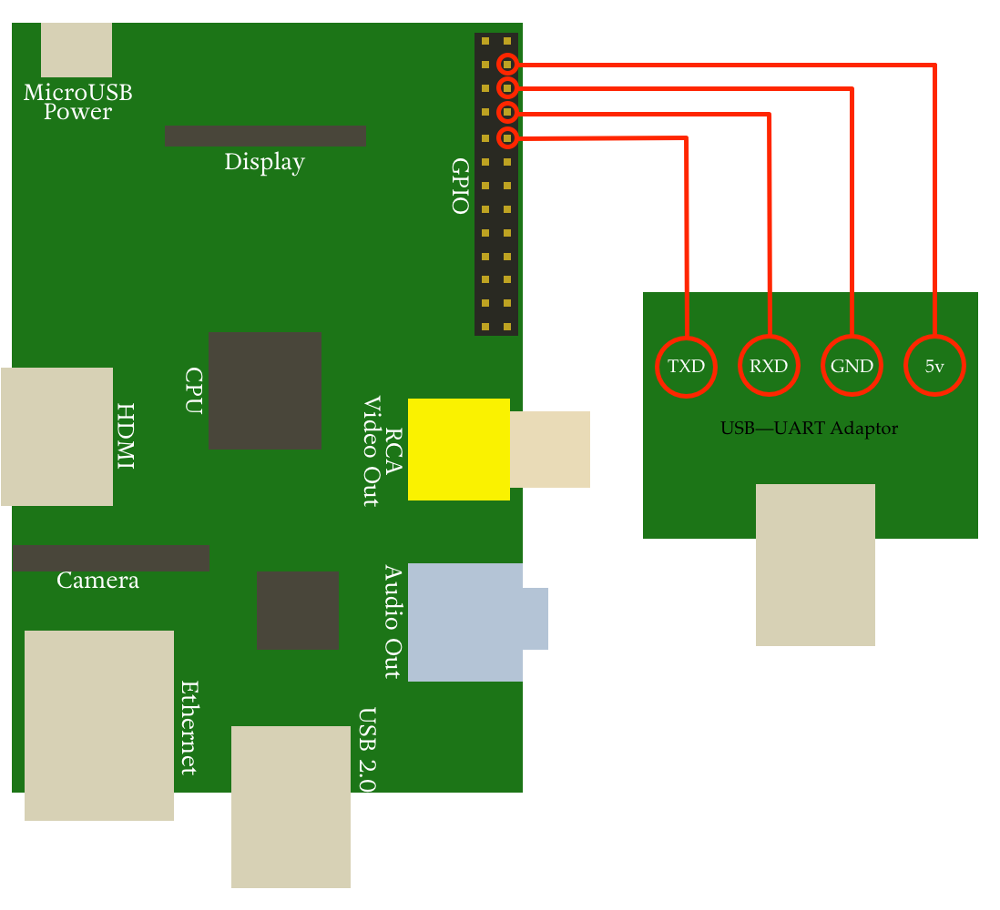

I play with my Raspberry Pi so rarely that I forget how to use my [CP2102 serial converter][1] to connect from my iMac or FreeBSD laptop to the Raspberry Pi, so I thought I'd write a blog post and then I'd have an easy place to go back to remember how... 
<!--more-->

## Connecting the cables

## On a Mac

1. Acquire a [CP2102 serial converter][3]
2. Download the driver ([direct link to zip file][4])
3. Reboot
4. Attach Raspberry Pi using a **USB 2.0 or older** port (_not USB 3_)
5. Open up Terminal.app and type: 
	screen -fn /dev/cu.SLAB_USBtoUART 115200 
The _fn_ flag disables flow-control 
And you're done! 

## On FreeBSD

1. Acquire a [CP2102 serial converter][5]
2. Load uslcom.ko—either add it to _loader.conf_, compile it into the kernel, or as root do: 
	kldload uslcom.ko
 

3. Attach Raspberry Pi via any USB port
4. Open up a terminal and as root (or via sudo), type: 
	cu -l /dev/ttyU0 -s 115200
 
 
And you're done!

  [1]: http://www.amazon.co.uk/gp/product/B00AFRXKFU
  [3]: http://www.amazon.co.uk/gp/product/B00AFRXKFU
  [4]: https://www.silabs.com/Support%20Documents/Software/Mac_OSX_VCP_Driver.zip
  [5]: http://www.amazon.co.uk/gp/product/B00AFRXKFU
