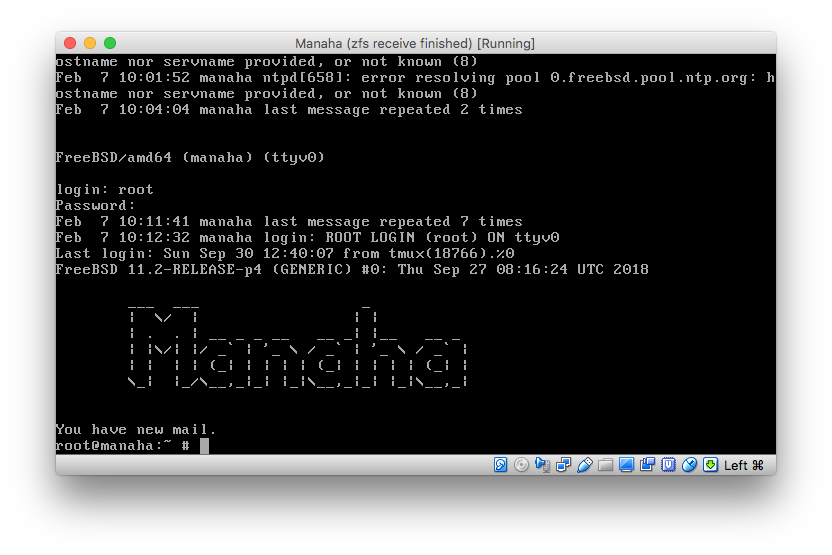

This was a beautiful sight this morning.  The image below is a VirtualBox console showing a booted FreeBSD system.  That system has been restored from a ZFS snapshot taken last November.  So, how did we do it?
<!--more-->


## Creating the Snapshot

First, let's take a look at actually creating the snapshot:

```
root@manaha:~ # zfs snapshot -r zroot@2018-11-06
root@manaha:~ # zfs send -Rv zroot@2018-11-06 | gzip | ssh backup@home "cat > /data/backup/manaha/2018-11-06.zfs.gz"  
```

This does a few things:

1. Snapshot my root dataset recursively
2. Use `zfs send` to create a stream of the zoot dataset and everything below it
3. Pipe to gzip which compresses the stream
4. SSH to a Raspberry Pi at home and cat the compressed stream into a file

The file mentioned above is simply a gzipped ZFS send stream, I've opted to use the extension `.zfs.gz` to remind myself of this, but of course `.flurb` would have worked equally as well.

We now have a snapshot of our system.

## Restoring the Snapshot

Creating snapshots is all well and good, but what if we can't restore them?  
I knew from previous experiments that I could `zfs receive` this file onto my FreeBSD laptop, but what if I did some major damage to my server and needed to restore the whole thing?  
It was getting to the point where a reinstallation and selective backup was looking like the most reliable (if not time consuming) method for restoring a complete server meltdown.

So how can we restore this image onto a clean machine?

First we need to boot a clean machine, I'm going to use [mfsBSD](https://mfsbsd.vx.sk) which I'll describe in [another post](/2019/02/07/setting-up-mfsbsd-for-receiving-zfs-snapshots-on-systems-with-low-memory/) - this will be an important post to ensure successful restoration on servers with not much RAM (4GB or less).

Once we have a mfsBSD image, boot into it and enable root access via SSH (I'll leave you to figure out the best way for *you* to do this).  
Being able to SSH into your mfsBSD instance as root will make life much easier, mainly because you can copy and paste which you can't often do in consoles.

So now we have convenient access, we need to partition the disks:

```
# First, find out what your drive is called
#   (mine is ada0 in VirtualBox)
# Second, create a partition scheme
gpart create -s gpt ada0

# Third, partition the disk
gpart add -a 1m -t freebsd-boot -s 512k -l boot ada0
gpart add -a 1m -t freebsd-swap -s 2g -l swap0 ada0
gpart add -a 1m -t freebsd-zfs -l zfs0 ada0

# Lastly, install the ZFS bootloader
gpart bootcode -b /boot/pmbr -p /boot/gptzfsboot -i 1 ada0
```

**Note**: The partitioning above matches my VPS, and yours should too.  Make sure you have a note somewhere of it, as that won't be backed up! My note is here:

```
gpart show
=>       40  165674928  da0  GPT  (79G)
         40       1024    1  freebsd-boot  (512K)
       1064        984       - free -  (492K)
       2048    4194304    2  freebsd-swap  (2.0G)
    4196352  161478616    3  freebsd-zfs  (77G)
```

Now we need to create a zpool for us to receive that compressed send stream:

```
zpool create -d -o altroot=/mnt zroot da0p3
```

**Edit 2022-02-17: Thanks to ianjs for pointing out the lack of device in the command above, and for suggesting the use of `-d`.**

The `-o altroot=/mnt` allows us to mount the zpool and receive the send stream without mucking around with our current environments root file system!  By default it would want to mount on `/`

Now we have all of the required pieces:

* root access via SSH
* partitioned disks
* a zpool waiting to receive

Let's log into the Raspberry Pi and get this VPS restored!

```
cat /data/backup/manaha/2018-11-06.zfs.gz | gunzip | ssh root@172.16.0.224 zfs receive -vF zroot
```

Sit and wait.  Once it's completed you need to get log back into the server and set the `bootfs` property, for me it was like this:

```
zpool set bootfs=zroot/ROOT/default zroot
```

Then eject the mfsBSD ISO and reboot into your restored system.
