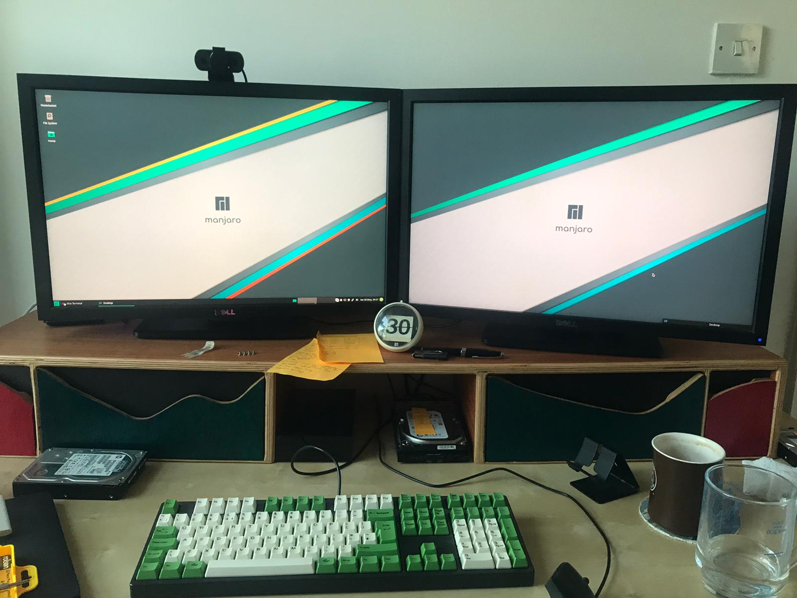

_Note: This post contains partially formed opinions and may sound like it's being overly negative.  This is a first impressions post by someone who rarely writes, let alone about first impressions.  I like what I've done, I'm happy with Linux and will stick with it._

Back in [2011 I bought a 27" iMac](/2012/02/08/just-an-update/) and it has long served me well.  I bought the best that I could afford at the time which I think is one of the reasons it has lasted me so long.

However all good things come to an end, back in 2018 Apple released macOS 10.14 "Mojave" which dropped support for my iMac.  I am still getting security updates, but it is only a matter of time before they stop too.  
I haven't come across any software that I _can't_ run on the iMac due to the OS, but that is only a matter of time too.

I'm not sure it's been mentioned on here, but I'm on a podcast now - [The Infinite Escape Room](https://www.theinfiniteescaperoom.com/).  [Mike](https://www.theinfiniteescaperoom.com/p/who-are-we-1582879073/) and I take it in turns to edit the podcast, for a long while I was using the venerable [Audacity](https://www.audacityteam.org/) but have recently switched to [Reaper](https://www.reaper.fm/).  
While the software runs nicely on my iMac, certain operations were sluggish.  Waiting over half an hour to render an intermediate edit was frustrating.

I've got an old 2013 Dell Optiplex 9090 ([Intel i7-4770](https://ark.intel.com/content/www/us/en/ark/products/75122/intel-core-i7-4770-processor-8m-cache-up-to-3-90-ghz.html), 24GB RAM, [nvidia GeForce GT 610](https://www.geforce.com/hardware/desktop-gpus/geforce-gt-610/buy-desktop)) which I thought I could use a trial machine for life on Linux.

Why not [FreeBSD](https://www.freebsd.org/)?  I love FreeBSD, it is clean and simple, logical, and has first class support for key technologies like ZFS.  
The "problem" with FreeBSD is that some of the software I want to use isn't supported.  For example: [Steam](https://store.steampowered.com/) doesn't support FreeBSD so I cannot run the games I enjoy playing; Reaper doesn't support FreeBSD - though I could try running it under WINE...But no thanks!

So I got a USB stick and downloaded [Ubuntu 20.04](https://ubuntu.com/)...And I really didn't like the experience.  I quickly switched to [Xubuntu](https://xubuntu.org/) (I use Xfce on FreeBSD) but again it felt lacking.  Finally I downloaded and installed [Ubuntu Budgie](https://ubuntubudgie.org/) and began using Linux.

Seeing as I had come from macOS, I was intrigued by [elementaryOS](https://elementary.io/).  However if I'm migrating away from the controlling grasp of Apple, I want to be able to make a few decisions - like installing the OS on ZFS as root.  Elementary didn't support this, where as the various flavours of Ubuntu 20.04 did.

So, what is the land of (Ubuntu) Linux like?  Weirdly complex, cluttered, yet featureful (most of the time)...  
Let's take a look at what I mean.

Weirdly complex:

* There's multiple places to get software, and they don't seem to talk to each other
  * Ubuntu has the [Software Centre](https://ubuntu.com/blog/tag/ubuntu-software-center), as well as the `apt` command(s).  Installing software using one method doesn't mean that the other knows you've installed it.  They also seem to be fed by different sources, in Software Centre I was only able to find the [Nextcloud](https://nextcloud.com/) server, I was only able to find and install the client using `apt` on the command line.
* Containerised apps
  * Some apps are native, others are [snap packages](https://snapcraft.io/).  It's not always clear what you're installing, and how supported they are.  Snap packages create a Snap directory in your home dir, and for me didn't seem to always put their settings in a nice place - certainly on one of my migrations some snaps didn't pick up on settings I had changed on an old install whereas others did.
  
Cluttered:

* ZFS hogs all the space  
  * ZFS is great, and with [Ubuntu's zsys](https://arstechnica.com/gadgets/2020/03/ubuntu-20-04s-zsys-adds-zfs-snapshots-to-package-management/) you get a snapshot whenever you add or remove packages.  As a new user there are many packages I want to install, and I don't have a list of them to install together.  The result is that after an hour I had over 100 snapshots on my system.  Now snapshots *are not bad*, they are really good and I employ them myself under FreeBSD using [sysutils/zfstools](https://www.freshports.org/sysutils/zfstools) and [sysutils/zxfer](https://www.freshports.org/sysutils/zxfer), but as a new user I'm busy moving things around and generating copies of large directories.  If a copy (e.g. of my Steam library) gets snapshotted, the space isn't reclaimed when I remove it - I've got to go and find the automatic snapshot and remove it myself.
* Processes everywhere
  * On the system I'm on now, I've got [Ghostwriter](https://wereturtle.github.io/ghostwriter/) open on an Xfce desktop.  There are 347 processes running.  Compare that to 105 processes that my FreeBSD server is using, while running eight jails containing multiple nginx servers, PHP parsers, a MySQL server and more.  The output of `top` and `ps` are difficult to read on Linux - I guess I'll be grepping a lot more or finding new tools.
* Where did that install to?  
  * I've talked about multiple places to install things _from_, but once installed where did that program just get installed to?  Under FreeBSD (and under [brew](https://brew.sh/) for macOS) 99.99% of packages get installed under `/usr/local/`, but on Linux I've had nothing installed into there.  Instead it seems to randomly get installed into one of the following: `/bin`, `/usr/bin`, or `/opt`.  Along with the fact that there doesn't seem to be a mechanism to checking out what applications I've installed vs what came with the initial install, it's difficult to remember what I've added and can remove safely.
  
Featureful:

* Steam has so many games!  
  * Thanks to the hard work done by WINE and Steam, there are many more games available on Linux than there were under my old iMac.
* Because of the Open Source nature of Linux, I'm given more control over the system than I am with macOS.

(mostly):

* No NTP installed by default and my clock drifted slightly
* No Quicklook - would obviously effect my on FreeBSD also
* No iCloud integration - thanks to Apple's lack of open standards
* No Twitter sync'ing - I used [Tweetbot](https://tapbots.com/tweetbot/) on macOS and iOS and they would sync together. Tweetbot isn't available on Linux and I can't figure out a way to keep another desktop client in sync...
* No [SIGINFO](https://en.wikipedia.org/wiki/Signal_(IPC)#SIGINFO).  Hitting `ctrl-t` in a terminal while waiting for `dd` or similar just prints out `^T`...

But despite all of that, I have survived.  Ubuntu Budgie was a very usable desktop, and I was able to get work done - such as podcast editing (with special thanks to [Drew DeVore](https://twitter.com/drewofdoom/) for giving some advice on Windows VSTs under Linux), and spinning up a FreeBSD VM to update Ports I maintain.

Some additional problems/issues have occurred due to my hardware.  Some of the games I want to play don't run well on my graphics card, and I'm missing hardware features that "came for free" with my iMac such as Bluetooth, WiFi, webcam, and SD card reader.

### Next...
I've had an itch for a couple of weeks, a niggle that maybe I wasn't totally happy because I was using Ubuntu, or maybe Budgie grated on me?  I'm not sure...  

[Chris Fisher](https://twitter.com/ChrisLAS) loves [Manjaro Linux](https://www.manjaro.org/), and I happen to love the podcasts Chris hosts and produces.  So I've spent a week reading about Manjaro, figuring out how to get a nice ZFS on root setup (more on that later hopefully), and spent yesterday and today installing and configuring it.  I'm not there yet, but it's coming along...

