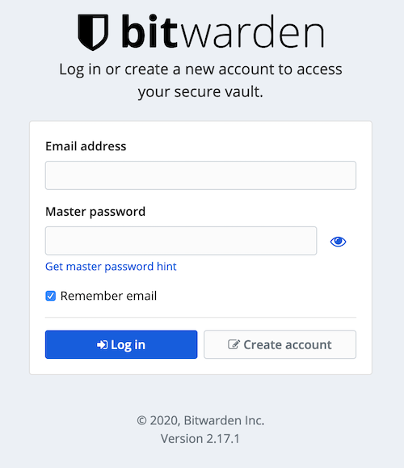

## Background

Almost two years ago I stopped managing my passwords with the excellent [1Password](https://1password.com/) and switched to [Bitwarden](https://bitwarden.com/).
<!--more-->
### Why?  

There were a couple of reasons why:

1. Unable to use 1Password on FreeBSD for two reasons:
  1. I sync my 1Password vault around using Dropbox, and Dropbox doesn't support FreeBSD.
  2. 1Password didn't support FreeBSD.
2. I wanted to move away from third-party hosted solutions.

Let's take a look at those:

In the above list, 1.1 can be solved by moving away from my free Dropbox account to the 1Password subscription-based cloud option.  While moving away from Dropbox was something I wanted to do (see 2 above), moving to another hosted solution is what I wanted to avoid (again, see 2).

For 1.2, this is still _partially_ true.  There is now, and has been since 2017, the command line client for 1Password: [security/1password-client](https://www.freshports.org/security/1password-client/).  However, this didn't offer me the same experience as my Mac, and I'm a stickler for consistency...Mostly...

### How?

I knew I wanted to do this for a while, and then I heard about [rubywarden](https://github.com/jcs/rubywarden) on [BSDNow](https://www.bsdnow.tv/).

So during some time off in February 2019, I added a Jail to my server and setup rubywarden.

I didn't install it using the Port ([security/ruby-bitwarden](https://www.freshports.org/security/ruby-bitwarden/)) because it wasn't available at the time, so instead went through the process of installing it myself from scratch.

It's always been a bit finicky, because I didn't have the Port to manage dependancies for me, anytime Ruby was updated rubywarden broke...In the end I kept the Jail OS up to date and everything else slowly became outdated.

Last time I checked the Github page I saw that it was [no longer being maintained](https://github.com/jcs/rubywarden/issues/122).

## Enter bitwarden_rs

The deprecation notice on rubywarden suggests anyone using it migrate to [bitwarden_rs](https://github.com/dani-garcia/bitwarden_rs), it's another unofficial Bitwarden backend written in Rust.

I had seen this project before, but things were working with rubywarden so I discounted it.  Since the end of August I've been trying to find time and motivation to migrate.  With Christmas here, what better time is there to play with password manager backends?

### Setup

First we need a new Jail to install this into:

```
root@manaha:~ # iocage create -T -r 12.2-RELEASE -n password
password successfully created!
root@manaha:~ # iocage set ip4_addr="lo1|10.0.0.8" password
ip4_addr: none -> lo1|10.0.0.8
root@manaha:~ # iocage set boot=on password
boot: 0 -> 1
root@manaha:~ # iocage start password
* Starting password
  + Started OK
  + Using devfs_ruleset: 1016 (iocage generated default)
  + Using IP options: ip4.addr=lo1|10.0.0.8 ip4.saddrsel=1 ip4=new ip6.saddrsel=1 ip6=new
  + Starting services OK
  + Executing poststart OK
```

A generic name, I know, but I've been moving away from jails with specific product names of late.

### Installation Options

From here I've got three decisions:

1. Build and install bitwarden_rs myself
2. Build and install from Ports - it was added on 2020-12-18: [security/bitwarden_rs](https://www.freshports.org/security/bitwarden_rs/)
3. Install from as a Package

3 is my preference since packages provide a quick download of everything you need, already compiled.

### Installation

1. Use latest Packages

```
mkdir -p /usr/local/etc/pkg/repos
echo 'FreeBSD: { url: "pkg+http://pkg.FreeBSD.org/${ABI}/latest" }' > /usr/local/etc/pkg/repos/FreeBSD.conf
```

2. Install some vim, which I always have in Jails

```
pkg install -y vim-console
```

3. Install bitwarden_rs

```
pkg install -y bitwarden_rs
```

And that's it!  We've installed bitwarden_rs.

### Running

The package we installed seems to use an SQLite database by default, so there's no additional configuration to hook it up to another database.

I'm fine with running my passwords using SQLite, it's how I've been doing it since early 2009.

The only configuration we need to do is enable the service, then we can start it:

```
root@password:~ # service bitwarden_rs enable
bitwarden_rs enabled in /etc/rc.conf
root@password:~# service bitwarden_rs start
Starting bitwarden_rs.
```
We can see that bitwarden_rs is running on port 8000:

```
root@password:~ # sockstat | grep bitwarden
www      bitwarden_ 21694 13 tcp4   10.0.0.8:8000         *:*
```

We're done in this Jail now, let's go configure the proxy.

### Proxying

I don't generally allow Jails to have direct access from the Internet, instead everything gets proxied through one of Jails.  The nginx block is going to look a bit like this:

```
server {
        listen 80;
        server_name bitwarden.mysite;
        return 301 https://$server_name$request_uri;
}

server {
        listen 443 ssl;

        ssl_certificate /usr/local/etc/ssl/mysite/fullchain.pem;
        ssl_certificate_key /usr/local/etc/ssl/mysite/privkey.pem;

	server_name bitwarden.mysite;

	location / {
		proxy_pass http://10.0.0.8:8000;
	}

	access_log /usr/local/var/log/nginx/bitwarden.mysite.log;
	error_log /usr/local/var/log/nginx/bitwarden.mysite.error.log;
}
```

This block will forward (301) anything on port 80 to HTTPS on port 443.

Traffic coming in on port 443 will get proxied to my password Jail on port 8000.

### Testing

Let's try accessing the site:



Success!  I was able to create an account that persists reboots.

I've exported my vault that was stored in rubywarden, and imported it into the web UI of bitwarden_rs.

### Cleanup

Stopping my old Jail will stop any clients from connecting to it and saving new or updated passwords:

```
root@manaha:~ # iocage stop rubywarden
* Stopping rubywarden
  + Executing prestop OK
  + Stopping services OK
  + Removing devfs_ruleset: 1004 OK
  + Removing jail process FAILED:
root@manaha:~ # iocage set boot=off rubywarden
boot: 1 -> 0
```

### Todo

All is left to do s reconfigure all of my clients to point to the new endpoint, then at some point in the future remove the old Jail once I'm really happy bitwarden_rs is configured correctly.
