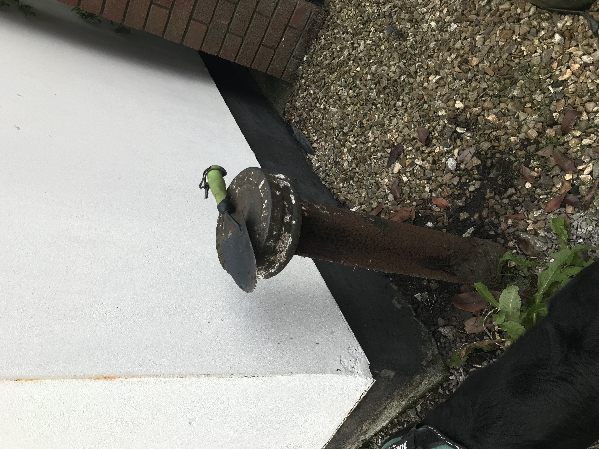
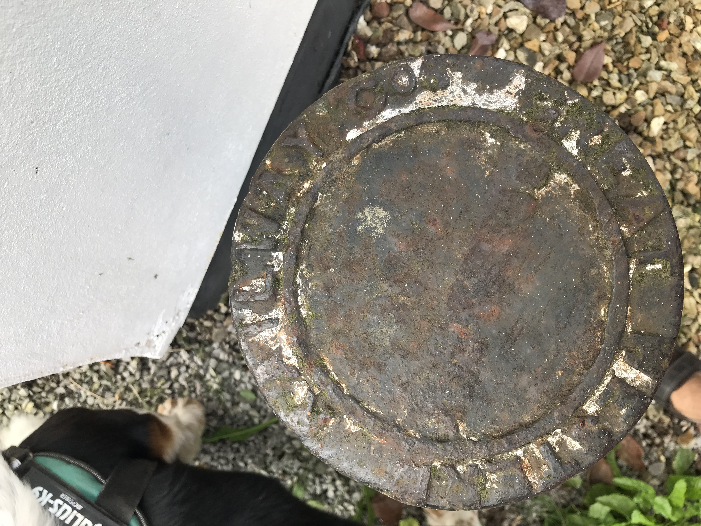
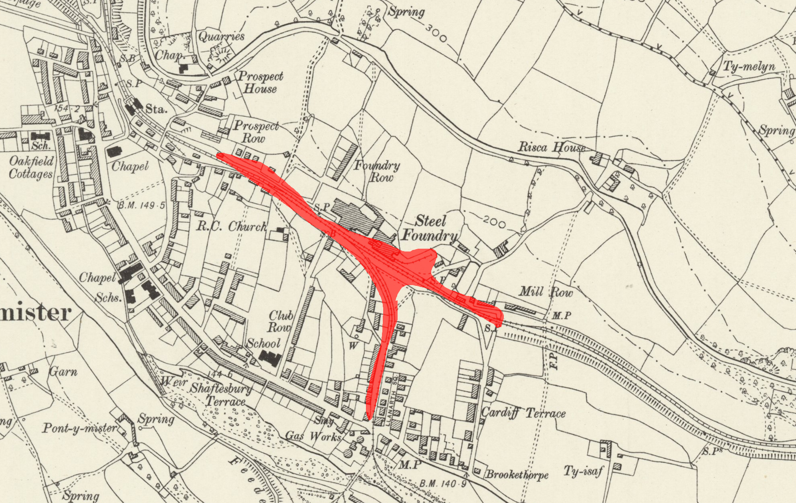

Back in June this year we bought our first house!  The process was stressful, and not something I want to go through again ant time soon!

Our house is located in the town of [Risca](https://en.wikipedia.org/wiki/Risca), well to be more precise it's actually in [Pontymister](https://en.wikipedia.org/wiki/Pontymister).

I had noticed a slightly odd metal thing poking out of the ground near our garage:
<!--more-->

There is some print on top, but it's worn and hard to read.  

But when I looked closer I could make out the word "RAILWAY", and the design looked somewhat familiar to me...Where had I seen this before?

Well I didn't have to wait long, the next time I took a walk to [Tredegar Grounds](https://britishlistedbuildings.co.uk/300022516-entrance-to-tredegar-grounds-risca) I found this near the old Terry Howell builders merchants:

This has text that is a little clearer:

> GREAT WESTERN RAILWAY COS BOUNDARY 1910

Looking at an old map (Thanks to [The National Library of Scotland](https://maps.nls.uk/)) we can see (overlayed in red by me) the railway line running near my house, and the nearby steel foundry.

While the main line is still present today, the line(s) going North/South are now a road.  So I presume these boundary markers are relics from the old line.  My neighbour suggested that there was also a depot here at some point, but looking at the map it's hard to see one - maybe the steel foundry had additional land not easily expressed on the map.

I have found that there is a Wikimedia category for [Boundary markers of the Great Western Railway](https://commons.wikimedia.org/wiki/Category:Boundary_markers_of_the_Great_Western_Railway).  I have added a couple of the markers I've found in Risca to it.

It's remarkable to think that after so long of _not_ working on the railway, that I'm still seeing things like this pop up so close to me - or mapbe it's just the Baader–Meinhof phenomenon?
